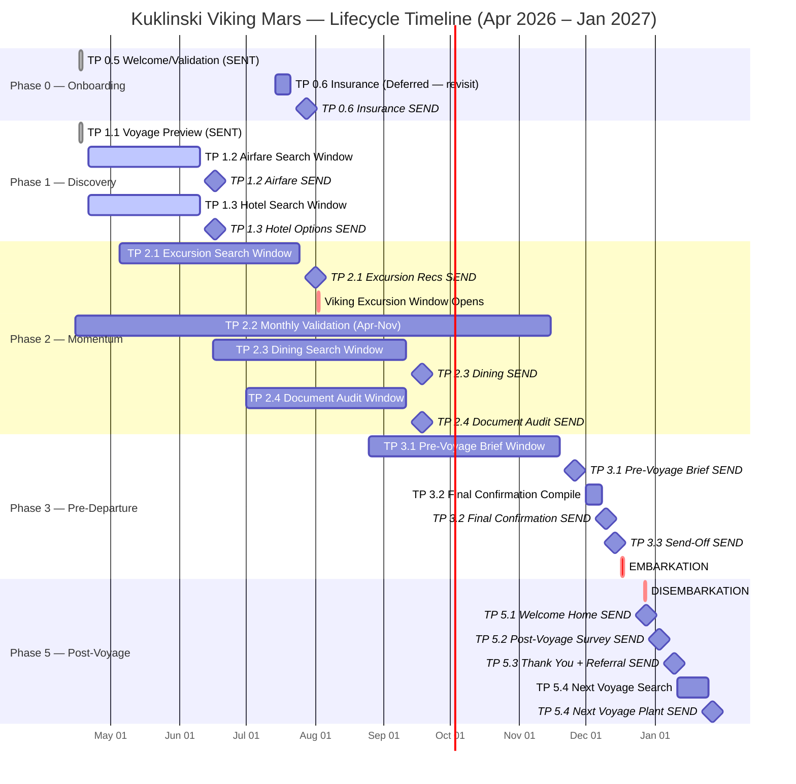
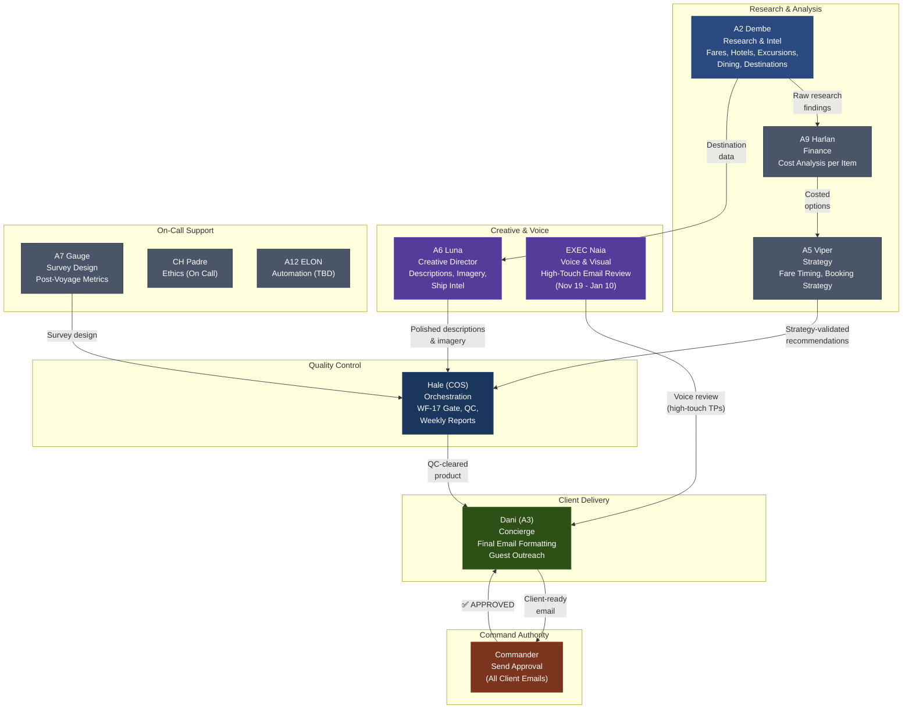

# KUKLINSKI GROUP — CLIENT LIFECYCLE MANAGEMENT
## Viking Mars | Panama Canal & Central America | Dec 17-27, 2026

---

<div align="center">

**DREAMS2MEMORIES TRAVEL, LLC**
*Seminal Canonical Lifecycle Document*

| | |
|---|---|
| **Document** | D2M-LC-KUKLINSKI-2026 |
| **Version** | 1.0 |
| **Created** | 2026-04-17 |
| **Owner** | Col Victoria Hale, COS |
| **Classification** | INTERNAL — Wing Operations |

</div>

---

## VOYAGE SHIELD

```
    ╔══════════════════════════════════════════════════════════╗
    ║                    VIKING MARS                          ║
    ║            PANAMA CANAL & CENTRAL AMERICA               ║
    ║                                                          ║
    ║   Panama City ──► Canal Transit ──► Cartagena            ║
    ║   Santa Marta ──► Puerto Limon ──► Fort Lauderdale       ║
    ║                                                          ║
    ║          6 GUESTS  ·  3 SUITES  ·  10 NIGHTS             ║
    ║            Dec 17, 2026 — Dec 27, 2026                   ║
    ║                                                          ║
    ║               TOTAL PAID: $21,244  ✅                     ║
    ╚══════════════════════════════════════════════════════════╝
```

---

## TABLE OF CONTENTS

1. [Booking Summary](#1-booking-summary)
2. [Guest Directory](#2-guest-directory)
3. [Itinerary & Ports](#3-itinerary--ports)
4. [Lifecycle Timeline (Gantt)](#4-lifecycle-timeline-gantt)
5. [Touchpoint Master Table](#5-touchpoint-master-table)
6. [Staff Workflow Pipeline](#6-staff-workflow-pipeline)
7. [Staff Load Summary](#7-staff-load-summary)
8. [Weekly Report Cadence](#8-weekly-report-cadence)
9. [Key Dates Sidebar](#9-key-dates-sidebar)
10. [Routing & Delivery Rules](#10-routing--delivery-rules)
11. [Status Legend](#11-status-legend)
12. [Document History](#12-document-history)

---

## 1. BOOKING SUMMARY

| Field | Booking 9593880 | Booking 9593873 | Booking 9595029 |
|-------|-----------------|-----------------|-----------------|
| **Agency Conf** | 1TSWFQR | LJ2O4YG | CUW88R8 |
| **Guests** | Kyle & Rosalie Kuklinski | Roger & Dr Nicholas Kuklinski | Joshua Morton & Erica Dodge |
| **Stateroom** | 4122 (DV1 — Deluxe Veranda) | 8012 (DV1 — Deluxe Veranda) | 3015 (V1 — Veranda) |
| **Deck** | 4 | 8 | 3 |
| **Fare Code** | OMAFSV26-3 ($3,799 pp) | OMAFSV26-3 ($3,799 pp) | OMAPSF26-3 ($3,099 pp) |
| **Total Paid** | $7,548 | $7,548 | $6,148 |
| **Viking SBC** | $200 ($100/guest) | $200 ($100/guest) | $200 ($100/guest) |
| **D2M SBC** | **$600** | -- | -- |
| **Total SBC** | **$800** | $200 | $200 |
| **Payment Status** | ✅ PAID IN FULL (Mar 27) | ✅ PAID IN FULL (Mar 27) | ✅ PAID IN FULL (Mar 27) |

**Grand Total Paid:** $21,244
**Combined Shipboard Credits:** $1,200 ($800 Kyle/Rosalie + $200 Roger/Nick + $200 Josh/Erica)
**Payment Method:** Kyle Kuklinski CC on file — all 3 bookings (CVC 7435 received Mar 25)
**Ancillary Status:** Cruise only — flights, hotel, transfers, insurance NOT YET BOOKED

---

## 2. GUEST DIRECTORY

| # | Guest | DOB | Email | Phone | Home Base | Air Route |
|---|-------|-----|-------|-------|-----------|-----------|
| 1 | **Kyle Stanley Kuklinski** | 1983-02-09 | kyle.kuklinski@gmail.com | 804-801-4762 | Richmond, VA | RIC → PTY |
| 2 | **Rosalie Morton Kuklinski** | 1985-03-04 | Rosalie.Kuklinski@gmail.com | 626-862-7110 | Richmond, VA | RIC → PTY |
| 3 | **Roger David Kuklinski** | 1951-09-08 | Roger.kuklinski@gmail.com | 704-609-6867 | Richmond, VA | RIC → PTY |
| 4 | **Dr Nicholas John Kuklinski** | 1981-06-16 | nikpack@gmail.com | 704-609-4024 | Richmond, VA | RIC → PTY |
| 5 | **Joshua Morton** | 1945-12-11 | Josh@jerichopix.com | 818-317-9843 | Naples, FL | RSW → FLL |
| 6 | **Erica Dodge** | 1948-03-04 | Buzzerica@gmail.com | 603-812-5173 | Naples, FL | RSW → FLL |

**Guest Form Status:**
- Kyle Kuklinski: ✅ Complete
- Rosalie Kuklinski: ✅ Complete
- Roger Kuklinski: ✅ Complete
- Dr Nicholas Kuklinski: ✅ Complete
- Joshua Morton: ⚠️ **MISSING** — follow up required
- Erica Dodge: ⚠️ **MISSING** — follow up required

---

## 3. ITINERARY & PORTS

| Day | Date | Port | Country | Notes |
|-----|------|------|---------|-------|
| 1 | Dec 17 (Thu) | **Panama City** | Panama | Embarkation 3:00 PM |
| 2 | Dec 18 (Fri) | **Panama Canal Transit** | Panama | Full canal daylight transit |
| 3 | Dec 19 (Sat) | **Cartagena** | Colombia | UNESCO Old Town, fortress |
| 4 | Dec 20 (Sun) | **Santa Marta** | Colombia | Tayrona gateway, historic center |
| 5 | Dec 21 (Mon) | **Puerto Limon** | Costa Rica | Rainforest, wildlife, Tortuguero |
| 6 | Dec 22 (Tue) | *Sea Day* | -- | At sea |
| 7 | Dec 23 (Wed) | *Sea Day* | -- | At sea |
| 8 | Dec 24 (Thu) | *Sea Day* | -- | Christmas Eve at sea |
| 9 | Dec 25 (Fri) | *Sea Day* | -- | Christmas Day at sea |
| 10 | Dec 26 (Sat) | *Sea Day* | -- | At sea |
| 11 | Dec 27 (Sun) | **Fort Lauderdale** | USA | Disembarkation 5:00 AM |

---

## 4. LIFECYCLE TIMELINE (GANTT)



---

## 5. TOUCHPOINT MASTER TABLE

### Phase 0 — Onboarding

| # | TP | Name | Search Window | Send Date | Status | Owner | Notes |
|---|-----|------|---------------|-----------|--------|-------|-------|
| 1 | **0.5** | Welcome / Validation | -- | Apr 17 | ✅ SENT | Dani | Sent to all 6 guests |
| 2 | **0.6** | Insurance Discussion | Jul 14 - Jul 21 | **Jul 28** | ⏸ DEFERRED | Dani | Client: no interest at this time (Apr 19). Revisit mid-July. **Arch note:** Insurance should be offered at initial post-booking gate (alongside TP0.5), then revisited mid-lifecycle if declined. |

### Phase 1 — Discovery

| # | TP | Name | Search Window | Send Date | Status | Owner | Notes |
|---|-----|------|---------------|-----------|--------|-------|-------|
| 3 | **1.1** | Voyage Preview | -- | Apr 17 | ✅ SENT | Dani | Panama Canal + ports overview |
| 4 | **1.2** | Airfare Watch | Apr 21 - Jun 10 | **Jun 17** | 🔵 ACTIVE SEARCH | A2 Dembe | **RIC → PTY** (Kyle/Rosalie, Roger/Nick) + **RSW → FLL** (Josh/Erica) |
| 5 | **1.3** | Hotel Options | Apr 21 - Jun 10 | **Jun 17** | 🔵 ACTIVE SEARCH | A2 Dembe | Panama City pre-cruise + FLL post-cruise |

### Phase 2 — Momentum

| # | TP | Name | Search Window | Send Date | Status | Owner | Notes |
|---|-----|------|---------------|-----------|--------|-------|-------|
| 6 | **2.1** | Excursion Recs | May 5 - Jul 25 | **Aug 1** | ⏳ PENDING | A2 Dembe | Recs ready before Viking window opens Aug 2 |
| 7 | **2.2** | Monthly Validation | -- | **15th of each month** (Apr-Nov) | 🔵 ACTIVE SEARCH | Dani | Monthly booking validation template. 8 sends total |
| 8 | **2.3** | Dining Research | Jun 16 - Sep 11 | **Sep 18** | ⏳ PENDING | A2 Dembe | Onboard dining + port restaurant recs |
| 9 | **2.4** | Document Audit | Jul 1 - Sep 11 | **Sep 18** | ⏳ PENDING | A2 Dembe | Passports, visas, health docs, guest forms |

### Phase 3 — Pre-Departure

| # | TP | Name | Search Window | Send Date | Status | Owner | Notes |
|---|-----|------|---------------|-----------|--------|-------|-------|
| 10 | **3.1** | Pre-Voyage Brief | Aug 25 - Nov 19 | **Nov 26** | ⏳ PENDING | A2 Dembe / Luna | Destination deep-dive, packing, logistics |
| 11 | **3.2** | Final Confirmation | Dec 1 - Dec 8 (compile) | **Dec 10** | ⏳ PENDING | Hale | All bookings, flights, hotels, transfers consolidated |
| 12 | **3.3** | Send-Off | -- | **Dec 14** | ⏳ PENDING | Dani | Bon voyage — 3 days before embarkation |

### Phase 5 — Post-Voyage

| # | TP | Name | Search Window | Send Date | Status | Owner | Notes |
|---|-----|------|---------------|-----------|--------|-------|-------|
| 13 | **5.1** | Welcome Home | -- | **Dec 28** | ⏳ PENDING | Dani | Day after disembarkation |
| 14 | **5.2** | Post-Voyage Survey | -- | **Jan 3, 2027** | ⏳ PENDING | A7 Gauge | NPS + experience survey |
| 15 | **5.3** | Thank You + Referral | -- | **Jan 10, 2027** | ⏳ PENDING | Dani / Naia | Handwritten-style thank you + referral ask |
| 16 | **5.4** | Next Voyage Plant | Jan 11 - Jan 25, 2027 | **Jan 27, 2027** | ⏳ PENDING | A5 Viper | Seed next trip based on preferences learned |

---

## 6. STAFF WORKFLOW PIPELINE



---

## 7. STAFF LOAD SUMMARY

| Staff Member | Role | Active Window | Touchpoints | Weekly Cadence | Peak Load |
|-------------|------|---------------|-------------|----------------|-----------|
| **Hale (COS)** | Orchestration, QC, WF-17 gate, weekly reports | Apr 17 - Jan 27, 2027 | ALL 16 | Continuous | Dec 1-14 (3 TPs in 2 weeks) |
| **A2 Dembe** | ALL research — fares, hotels, excursions, dining, destinations | Apr 21 - Nov 19 | TP 1.2, 1.3, 2.1, 2.3, 2.4, 3.1 | Mon AM reports | May-Jul (3 parallel searches) |
| **A9 Harlan** | Cost analysis per research item | Apr 21 - Sep 18 | TP 1.2, 1.3, 2.1, 2.3 | With A2 deliverables | Jun (airfare + hotel costing) |
| **A5 Viper** | Booking strategy, fare timing, next-voyage planning | Apr 21 - Jun 17, Jan 11-27 | TP 1.2, 5.4 | Ad hoc | Apr-Jun (fare strategy) |
| **A6 Luna** | Property/destination descriptions, imagery, ship intel | Apr 21 - Nov 26 | TP 1.3, 2.1, 2.3, 3.1 | With A2 deliverables | Aug-Nov (pre-voyage content) |
| **Dani (A3)** | Final client email formatting, guest outreach | All send dates | ALL client-facing TPs | Per send schedule | Dec 10-28 (4 sends in 18 days) |
| **EXEC Naia** | Voice review on high-touch emails | Nov 19 - Jan 10, 2027 | TP 3.1, 3.2, 3.3, 5.1, 5.3 | Per send schedule | Dec (pre-departure voice QC) |
| **A7 Gauge** | Survey design, post-voyage metrics | Dec 29 - Jan 10, 2027 | TP 5.2 | N/A | Jan 3 (survey launch) |
| **CH Padre** | Ethics (on call) | Entire lifecycle | As needed | N/A | -- |
| **A12 ELON** | Automation build | TBD | TBD | N/A | -- |

---

## 8. WEEKLY REPORT CADENCE

All weekly reports are **FULL SENDS to johnloucks3@gmail.com** (per Standing Order 27 MAR 2026 — not drafts).

| Report Stream | Period | Frequency | Day | Lead | Content |
|--------------|--------|-----------|-----|------|---------|
| **Airfare + Hotel Combined** | Apr 21 - Jun 10 | Weekly | Mon AM | A2 Dembe | RIC-PTY fares, RSW-FLL fares, Panama City hotels, FLL hotels, price trends |
| **Excursion Research** | May 5 - Jul 25 | Weekly | Mon AM | A2 Dembe | Cartagena, Santa Marta, Puerto Limon excursion options, Viking vs independent |
| **Dining Intel** | Jun 16 - Sep 11 | Weekly | Mon AM | A2 Dembe | Port dining recs, onboard specialty dining, holiday meal considerations |
| **Monthly Validation** | Apr 15 - Nov 15 | Monthly | 15th | Dani | Booking status, payment confirmation, upcoming milestones, guest form status |
| **Pre-Voyage Brief Assembly** | Aug 25 - Nov 19 | Weekly | Mon AM | A2 Dembe / Luna | Destination guides, packing lists, logistics, weather, health advisories |

### Report Overlap Calendar

| Month | Active Report Streams |
|-------|----------------------|
| **Apr** | Airfare+Hotel |
| **May** | Airfare+Hotel, Excursion |
| **Jun** | Airfare+Hotel, Excursion, Dining |
| **Jul** | Excursion, Dining |
| **Aug** | Dining, Pre-Voyage Brief |
| **Sep** | Dining, Pre-Voyage Brief |
| **Oct** | Pre-Voyage Brief |
| **Nov** | Pre-Voyage Brief |

---

## 9. KEY DATES SIDEBAR

### Critical External Dates

| Date | Event | Action Required |
|------|-------|-----------------|
| **Aug 2, 2026** | Viking excursion booking window opens | Excursion recs (TP 2.1) must be delivered by Aug 1 |
| **Dec 17, 2026** | Embarkation — Panama City, 3:00 PM | All pre-departure TPs complete by Dec 14 |
| **Dec 27, 2026** | Disembarkation — Fort Lauderdale, 5:00 AM | Post-voyage sequence begins Dec 28 |

### Internal Milestone Dates

| Date | Milestone | Status |
|------|-----------|--------|
| Mar 25 | CVC received (7435) — payment unblocked | ✅ |
| Mar 27 | **PAID IN FULL — $21,244** | ✅ |
| Apr 17 | TP 0.5 Welcome/Validation sent | ✅ |
| Apr 17 | TP 1.1 Voyage Preview sent | ✅ |
| Apr 19 | TP 0.6 Insurance — client declined, DEFERRED | ⏸ DEFERRED |
| Apr 21 | Research phase begins (airfare + hotel) | 🔵 UPCOMING |
| Jul 14-21 | TP 0.6 Insurance re-sprint | ⏳ |
| Jul 28 | TP 0.6 Insurance send (deferred) | ⏳ |
| May 5 | Excursion research begins | ⏳ |
| Jun 10 | Airfare + hotel search window closes | ⏳ |
| Jun 16 | Dining research begins | ⏳ |
| Jun 17 | TP 1.2 Airfare Watch + TP 1.3 Hotel Options send | ⏳ |
| Jul 1 | Document audit begins | ⏳ |
| Jul 25 | Excursion search window closes | ⏳ |
| Aug 1 | TP 2.1 Excursion Recs send | ⏳ |
| Aug 2 | **Viking excursion booking window opens** | ⏳ |
| Aug 25 | Pre-voyage brief assembly begins | ⏳ |
| Sep 11 | Dining + document audit windows close | ⏳ |
| Sep 18 | TP 2.3 Dining + TP 2.4 Document Audit send | ⏳ |
| Nov 19 | Pre-voyage brief window closes | ⏳ |
| Nov 26 | TP 3.1 Pre-Voyage Brief send | ⏳ |
| Dec 1-8 | TP 3.2 Final Confirmation compile | ⏳ |
| Dec 10 | TP 3.2 Final Confirmation send | ⏳ |
| Dec 14 | TP 3.3 Send-Off | ⏳ |
| **Dec 17** | **EMBARKATION** | ⏳ |
| **Dec 27** | **DISEMBARKATION** | ⏳ |
| Dec 28 | TP 5.1 Welcome Home | ⏳ |
| Jan 3, 2027 | TP 5.2 Post-Voyage Survey | ⏳ |
| Jan 10, 2027 | TP 5.3 Thank You + Referral | ⏳ |
| Jan 11-25, 2027 | TP 5.4 Next Voyage search window | ⏳ |
| Jan 27, 2027 | TP 5.4 Next Voyage Plant send | ⏳ |

---

## 10. ROUTING & DELIVERY RULES

### Email Routing

| Product Type | Created In | Sent To | Delivery Method |
|-------------|------------|---------|-----------------|
| **Weekly research reports** | d2mconcierge@gmail.com | johnloucks3@gmail.com | **FULL SEND** (SO 27 MAR 2026) |
| **Monthly validation emails** | d2mconcierge@gmail.com | johnloucks3@gmail.com (draft review) then client | **DRAFT** in d2mconcierge + copy to johnloucks3 at 0600 |
| **Client touchpoint emails** (TP sends) | d2mconcierge@gmail.com | Client(s) via concierge@d2mluxury.quest | **DRAFT** for Commander approval (WF-17 gate) |
| **Intel/brief products** | d2mconcierge@gmail.com | johnloucks3@gmail.com | **FULL SEND** |

### Send Gate Protocol

1. **Dani** formats the client email
2. **Hale** runs WF-17 quality gate:
   - Logo renders correctly
   - Sig block: concierge@d2mluxury.quest
   - Stationery: cream #f7f3ea, blue #0000ff, Georgia serif
   - Sign-off: "Thanks" or "Thank you" (never "Best")
   - No AI disclaimers, no "happy to help," no concierge announcements
3. **Draft** placed in d2mconcierge Gmail + copy to johnloucks3 at 0600
4. **Commander** reviews and approves/edits
5. **Send** executed only after explicit Commander "yes"

### Stationery Standard

| Element | Value |
|---------|-------|
| Paper | Cream #f7f3ea |
| Ink | Bright Blue #0000ff |
| Font | Georgia, serif |
| Logo | D2M navy banner |
| Sign-off | "Thanks" or "Thank you" |
| From | concierge@d2mluxury.quest (send-as alias on d2mconcierge) |
| Phone | 719-291-0742 |

---

## 11. STATUS LEGEND

| Indicator | Meaning |
|-----------|---------|
| ✅ SENT | Touchpoint delivered to client |
| 🔵 ACTIVE SEARCH | Research window open, staff actively working |
| ⏳ PENDING | Not yet started — future window |
| 🔴 OVERDUE | Past due date, requires immediate action |
| ⚠️ ATTENTION | Requires manual intervention or follow-up |

---

## 12. DOCUMENT HISTORY

| Version | Date | Author | Change |
|---------|------|--------|--------|
| 1.0 | 2026-04-17 | Hale (COS) | Seminal canonical document created. All 16 touchpoints mapped across 5 phases. Staff assignments, Gantt timeline, workflow pipeline, and weekly report cadence established. |

---

## CROSS-REFERENCES

| Document | Location | Purpose |
|----------|----------|---------|
| Client Dossier | `~/Thunderbird/dossiers/Kuklinski_Viking_Panama.md` | Guest details, booking confirmations, email log, validation matrix |
| Client Context | `~/Thunderbird/storage/cache/client_context/kuklinski_context.json` | Cached client intelligence |
| Thunderbird Master Plan | `~/Thunderbird/THUNDERBIRD_MASTER_PLAN.md` (Part 5) | Active bookings registry |
| Drive Client Folder | Thunderbird_Client_Files / Kuklinski | Google Drive mirror |
| Viking Mars Ship Intel | `~/Thunderbird/core/intel/` | Ship intelligence data |
| Dossier Conventions | `~/Thunderbird/dossiers/CLAUDE.md` | FPD rules, naming, required fields |

---

*Document: D2M-LC-KUKLINSKI-2026 | Dreams2Memories Travel, LLC | Thunderbird Wing Operations*
*Owner: Col Victoria Hale, COS | Classification: INTERNAL*
