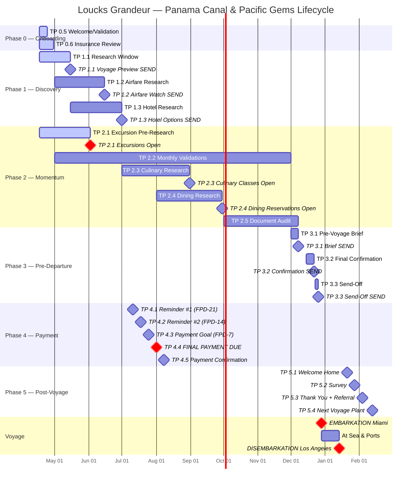
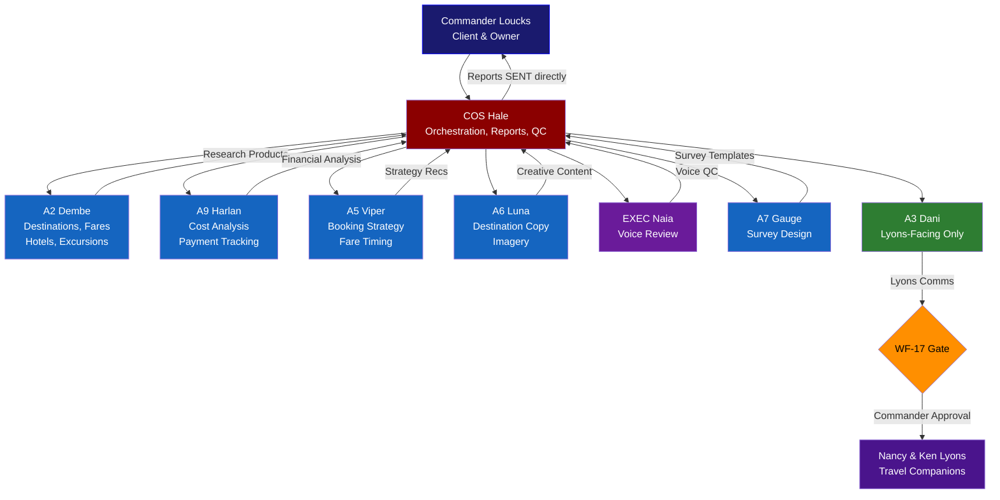

# LOUCKS — SEVEN SEAS GRANDEUR — PANAMA CANAL & PACIFIC GEMS
## Client Lifecycle Management Plan
### Dreams2Memories Travel, LLC | Thunderbird Wing
*Created: 2026-04-17 | COS: Col Victoria Hale | Booking: 3122006*

---

## TITLE BLOCK

| Field | Details |
|-------|---------|
| **Client** | John & Susan Loucks (Commander & spouse) |
| **Travel Companions** | Nancy & Ken Lyons (separate booking) |
| **Ship** | Seven Seas Grandeur (Regent Seven Seas Cruises) |
| **Route** | Panama Canal & Pacific Gems — Miami to Los Angeles |
| **Duration** | 16 nights |
| **Embarkation** | December 29, 2026 — Miami, FL |
| **Disembarkation** | January 14, 2027 — Los Angeles, CA |
| **Suite** | 658, Deck 6 — Concierge Suite E (447 sq ft) |
| **Booking** | 3122006 |
| **Total** | $25,798 ($1,000 deposit paid, **$24,798 balance due Aug 1**) |
| **Shipboard Credits** | $300 |
| **Guest Registration** | **BOTH INCOMPLETE** |
| **Dossier** | `dossiers/Loucks_Regent_Grandeur_3122006.md` |

### OWNER-CLIENT PROTOCOL
> This is the Commander's personal cruise. Hale manages the lifecycle FOR the Commander.
> - **No WF-17 gate** — Commander IS the recipient.
> - **Reports SENT to johnloucks3@gmail.com** directly (not drafted).
> - **Lyons-facing communications DO require WF-17** — Dani formats, COS reviews, Commander approves.
> - Lyons share logistics but have their own booking.

---

## PORTS OF CALL

| # | Port | Country | Notes |
|---|------|---------|-------|
| 1 | **Miami, FL** | USA | Embarkation — Dec 29 |
| 2 | George Town | Grand Cayman | |
| 3 | Cartagena | Colombia | |
| 4 | **Panama Canal Transit** | Panama | Full transit — centerpiece |
| 5 | Puntarenas | Costa Rica | |
| 6 | Puerto Quetzal | Guatemala | |
| 7 | Acapulco | Mexico | |
| 8 | Cabo San Lucas | Mexico | |
| 9 | San Diego | CA, USA | |
| 10 | **Los Angeles, CA** | USA | Disembarkation — Jan 14 |

---

## KEY DATES — REGENT PORTAL WINDOWS

| Date | Milestone | Status |
|------|-----------|--------|
| Jan 16, 2026 | Insurance pre-existing condition window closed | ⚠️ CLOSED |
| Jan 25, 2026 | Deposit received ($1,000) | ✅ PAID |
| **Jun 2, 2026** | **Shore excursions open (8pm ET)** | ⏳ PENDING |
| Jul 11, 2026 | Payment Reminder #1 (FPD-21) | ⏳ PENDING |
| Jul 18, 2026 | Payment Reminder #2 (FPD-14) | ⏳ PENDING |
| Jul 25, 2026 | Payment Goal (FPD-7) | ⏳ PENDING |
| **Aug 1, 2026** | **FINAL PAYMENT DUE — $24,798** | ⚠️ CRITICAL |
| Aug 8, 2026 | Payment Confirmation (FPD+7) | ⏳ PENDING |
| **Aug 31, 2026** | **Culinary Arts Kitchen Classes open (8pm ET)** | ⏳ PENDING |
| **Sep 30, 2026** | **Dining reservations open (8pm ET)** | ⏳ PENDING |
| **Dec 8, 2026** | **Online check-in opens** | ⏳ PENDING |
| Dec 22, 2026 | Final Confirmation (E-7) | ⏳ PENDING |
| Dec 26, 2026 | Send-Off (E-3) | ⏳ PENDING |
| **Dec 29, 2026** | **EMBARKATION — Miami** | ⏳ PENDING |
| **Jan 14, 2027** | **DISEMBARKATION — Los Angeles** | ⏳ PENDING |

---

## GANTT CHART — LIFECYCLE TIMELINE

---

## STAFF WORKFLOW

---

## MASTER TOUCHPOINT TABLE

> **Reference by row number.** Status: ✅ SENT | 🔵 ACTIVE | ⏳ PENDING | 🔴 OVERDUE | ⚠️ CRITICAL

| Row | TP ID | Phase | Description | Send Date | Search Start | Search End | Staff Lead | Status | Notes |
|-----|-------|-------|-------------|-----------|-------------|------------|------------|--------|-------|
| 1 | 0.5 | 0 — Onboarding | Welcome/Validation — confirm booking, guest reg reminder | 2026-04-24 | 2026-04-17 | 2026-04-24 | Hale | 🔵 ACTIVE | BOTH guest registrations incomplete. Confirm suite 658, $24,798 balance, Aug 1 FPD. |
| 2 | 0.6 | 0 — Onboarding | Insurance Review — pre-existing window already closed Jan 16 | 2026-04-30 | 2026-04-17 | 2026-04-30 | Hale + A9 | 🔵 ACTIVE | Window closed. Still need standard policy. Quote Allianz/Travel Guard/IMG. |
| 3 | 1.1 | 1 — Discovery | Voyage Preview — destination guide, all 10 ports | 2026-05-15 | 2026-04-17 | 2026-05-12 | A2 + A6 | 🔵 ACTIVE | A2 researches all ports. A6 writes narrative copy. 8 international + 2 domestic ports. |
| 4 | 1.2 | 1 — Discovery | Airfare Watch — COS-MIA outbound, LAX-COS return; Lyons GA-MIA, LAX-GA | 2026-06-15 | 2026-05-01 | 2026-06-12 | A2 + A5 | ⏳ PENDING | Two origin cities: COS (Loucks) + GA (Lyons). Monitor fare trends 4-6 mo out sweet spot. |
| 5 | 1.3 | 1 — Discovery | Hotel Options — Miami pre-cruise (Dec 28), LA post-cruise (Jan 14) | 2026-07-01 | 2026-05-15 | 2026-06-28 | A2 | ⏳ PENDING | Miami night eliminates same-day travel risk. LA night if late LAX-COS flights. |
| 6 | 2.1 | 2 — Momentum | Excursion Research — 8+ ports, opens Jun 2! Pre-research critical | 2026-06-02 | 2026-04-17 | 2026-05-30 | A2 | 🔵 ACTIVE | Research MUST complete before Jun 2 portal opening. 8 international ports + Panama transit. Popular excursions sell out fast. |
| 7 | 2.2 | 2 — Momentum | Monthly Validation — rolling check May through Dec | Monthly (1st) | 2026-05-01 | 2026-12-01 | Hale | ⏳ PENDING | 8 validations: May 1, Jun 1, Jul 1, Aug 1, Sep 1, Oct 1, Nov 1, Dec 1. |
| 8 | 2.3 | 2 — Momentum | Culinary Arts Kitchen Classes — opens Aug 31 (8pm ET) | 2026-08-31 | 2026-07-01 | 2026-08-28 | A2 | ⏳ PENDING | Research class offerings and timing before portal opens. Book opening night. |
| 9 | 2.4 | 2 — Momentum | Dining Reservations — opens Sep 30 (8pm ET) | 2026-09-30 | 2026-08-01 | 2026-09-27 | A2 | ⏳ PENDING | Research specialty dining options aboard Grandeur. Compass Rose, Prime 7, Chartreuse, Pacific Rim, Sette Mari. |
| 10 | 2.5 | 2 — Momentum | Document Audit — passports, guest registration, visa requirements | 2026-10-15 | 2026-10-01 | 2026-10-12 | Hale | ⏳ PENDING | Passports valid through Jul 14, 2027. Colombia/Costa Rica/Guatemala/Mexico/Panama entry reqs. Guest reg MUST be complete before Dec 8 check-in. |
| 11 | 3.1 | 3 — Pre-Departure | Pre-Voyage Brief — comprehensive trip packet, 21 days out | 2026-12-08 | 2026-12-01 | 2026-12-07 | Hale + A2 + A6 | ⏳ PENDING | Coincides with online check-in opening. Full brief: ports, weather, packing, excursions, dining, logistics. |
| 12 | 3.2 | 3 — Pre-Departure | Final Confirmation — 7 days out, all logistics locked | 2026-12-22 | 2026-12-15 | 2026-12-21 | Hale | ⏳ PENDING | Flights confirmed, transfers booked, hotel locked, excursions set, check-in complete. |
| 13 | 3.3 | 3 — Pre-Departure | Send-Off — 3 days out, bon voyage | 2026-12-26 | 2026-12-23 | 2026-12-25 | Hale + A6 | ⏳ PENDING | Final weather, embarkation logistics, emergency contacts, Regent app reminder. |
| 14 | 4.1 | 4 — Payment | Payment Reminder #1 — FPD minus 21 days | 2026-07-11 | 2026-07-08 | 2026-07-10 | Hale + A9 | ⏳ PENDING | **$24,798 balance.** Surface payment options and timeline. |
| 15 | 4.2 | 4 — Payment | Payment Reminder #2 — FPD minus 14 days | 2026-07-18 | 2026-07-15 | 2026-07-17 | Hale + A9 | ⏳ PENDING | Second reminder. Confirm payment method on file. |
| 16 | 4.3 | 4 — Payment | Payment Goal — FPD minus 7 days | 2026-07-25 | 2026-07-22 | 2026-07-24 | Hale + A9 | ⏳ PENDING | Target: pay before deadline. Avoid last-day risk. |
| 17 | 4.4 | 4 — Payment | **FINAL PAYMENT DUE** | **2026-08-01** | — | — | **A9** | ⚠️ CRITICAL | **$24,798 due to Regent. Non-negotiable deadline. Cancellation risk if missed.** |
| 18 | 4.5 | 4 — Payment | Payment Confirmation — FPD plus 7 days | 2026-08-08 | 2026-08-02 | 2026-08-07 | A9 | ⏳ PENDING | Verify payment processed. Confirm new balance $0. Update dossier. |
| 19 | 5.1 | 5 — Post-Voyage | Welcome Home — 7 days after disembarkation | 2027-01-21 | 2027-01-18 | 2027-01-20 | Hale | ⏳ PENDING | Debrief, photo highlights, initial experience capture. |
| 20 | 5.2 | 5 — Post-Voyage | Survey — 14 days after disembarkation | 2027-01-28 | 2027-01-25 | 2027-01-27 | A7 | ⏳ PENDING | Gauge designs survey. Capture what worked, what didn't, supplier performance. |
| 21 | 5.3 | 5 — Post-Voyage | Thank You + Referral — 21 days after disembarkation | 2027-02-04 | 2027-02-01 | 2027-02-03 | Hale + A6 | ⏳ PENDING | Personalized thank-you. Referral ask for Lyons contacts. |
| 22 | 5.4 | 5 — Post-Voyage | Next Voyage Plant — 30 days after disembarkation | 2027-02-13 | 2027-02-10 | 2027-02-12 | A5 + A2 | ⏳ PENDING | Nancy mentioned Africa/India interest. Viper develops strategy for next booking. |

---

## SEARCH WINDOW DETAILS

> **90-120 day lead time standard.** Adjusted for Regent portal windows and hard deadlines.

| TP | Search Window Opens | Search Window Closes | Send Date | Lead Days | Hard Constraint |
|----|--------------------|--------------------|-----------|-----------|-----------------|
| 0.5 | **2026-04-17 (NOW)** | 2026-04-24 | 2026-04-24 | 7 | Guest registration incomplete |
| 0.6 | **2026-04-17 (NOW)** | 2026-04-30 | 2026-04-30 | 13 | Pre-existing window already closed |
| 1.1 | **2026-04-17 (NOW)** | 2026-05-12 | 2026-05-15 | 28 | 10 ports to research |
| 1.2 | 2026-05-01 | 2026-06-12 | 2026-06-15 | 59 | 4-6 month sweet spot for Dec fares |
| 1.3 | 2026-05-15 | 2026-06-28 | 2026-07-01 | 75 | Miami Dec 28 + LA Jan 14 |
| 2.1 | **2026-04-17 (NOW)** | 2026-05-30 | 2026-06-02 | 46 | **Must complete BEFORE Jun 2 portal open** |
| 2.2 | Monthly | Monthly | 1st of month | — | May-Dec rolling validation |
| 2.3 | 2026-07-01 | 2026-08-28 | 2026-08-31 | 62 | Regent portal opens 8pm ET |
| 2.4 | 2026-08-01 | 2026-09-27 | 2026-09-30 | 60 | Regent portal opens 8pm ET |
| 2.5 | 2026-10-01 | 2026-10-12 | 2026-10-15 | 75 days before embarkation | Guest reg MUST be done before Dec 8 |
| 3.1 | 2026-12-01 | 2026-12-07 | 2026-12-08 | 21 days before embarkation | Coincides with online check-in |
| 3.2 | 2026-12-15 | 2026-12-21 | 2026-12-22 | 7 days before embarkation | All logistics locked |
| 3.3 | 2026-12-23 | 2026-12-25 | 2026-12-26 | 3 days before embarkation | Bon voyage |
| 4.1 | 2026-07-08 | 2026-07-10 | 2026-07-11 | FPD-21 | $24,798 |
| 4.2 | 2026-07-15 | 2026-07-17 | 2026-07-18 | FPD-14 | $24,798 |
| 4.3 | 2026-07-22 | 2026-07-24 | 2026-07-25 | FPD-7 | $24,798 |
| 4.4 | — | — | **2026-08-01** | **FPD** | **$24,798 — CANCELLATION RISK** |
| 4.5 | 2026-08-02 | 2026-08-07 | 2026-08-08 | FPD+7 | Verify payment posted |
| 5.1 | 2027-01-18 | 2027-01-20 | 2027-01-21 | E+7 | Welcome home |
| 5.2 | 2027-01-25 | 2027-01-27 | 2027-01-28 | E+14 | Survey |
| 5.3 | 2027-02-01 | 2027-02-03 | 2027-02-04 | E+21 | Thank you + referral |
| 5.4 | 2027-02-10 | 2027-02-12 | 2027-02-13 | E+30 | Next voyage plant |

---

## STAFF LOAD SUMMARY

| Staff | Role in This Lifecycle | Active TPs | Peak Load Period |
|-------|----------------------|-----------|-----------------|
| **Hale** | Orchestration, reports, QC, direct Commander comms | 0.5, 0.6, 2.2, 2.5, 3.1, 3.2, 3.3, 4.1, 4.2, 4.3, 5.1, 5.3 | Jul (payment) + Dec (pre-departure) |
| **A2 Dembe** | Destinations, fares, hotels, excursions, culinary/dining research | 1.1, 1.2, 1.3, 2.1, 2.3, 2.4, 3.1, 5.4 | Apr-Jun (discovery + excursion pre-research) |
| **A9 Harlan** | Cost analysis, payment tracking, insurance quotes | 0.6, 4.1, 4.2, 4.3, 4.4, 4.5 | Jul-Aug (payment sequence) |
| **A5 Viper** | Booking strategy, fare timing, next-voyage strategy | 1.2, 5.4 | May-Jun (airfare) + Feb 2027 (next voyage) |
| **A6 Luna** | Destination descriptions, imagery, creative content | 1.1, 3.1, 3.3, 5.3 | May (voyage preview) + Dec (send-off) |
| **EXEC Naia** | Voice review on any Lyons-facing communications | As needed | — |
| **A7 Gauge** | Survey design | 5.2 | Jan 2027 |
| **A3 Dani** | Format Lyons-facing communications only | As needed (Lyons only) | — |

---

## WEEKLY REPORT CADENCE

**Pattern:** Monday AM report SENT to johnloucks3@gmail.com
**Start:** Week of April 21, 2026
**End:** Week of February 16, 2027

| Week Of | Report Focus | Key Items |
|---------|-------------|-----------|
| Apr 21 | Launch | TP 0.5 + 0.6 status. Guest registration reminder. Insurance quote progress. |
| Apr 28 | Discovery Kickoff | TP 1.1 research progress. Excursion pre-research (TP 2.1) initiated. |
| May 5 | Port Research | A2 port research completion. TP 1.1 Voyage Preview prep. |
| May 12 | Voyage Preview | TP 1.1 send readiness. Airfare watch initiated (TP 1.2). |
| May 19 | Airfare + Excursions | Fare trends COS-MIA / LAX-COS. Excursion research progress. Lyons GA routes. |
| May 26 | Excursion Final Prep | TP 2.1 research must be complete. Jun 2 portal opening imminent. |
| Jun 2 | **EXCURSION PORTAL OPENS** | Book priority excursions immediately. Panama Canal transit is must-book. |
| Jun 9 | Excursion Booking Status | Excursions booked? Gaps? Waitlists? |
| Jun 16 | Airfare + Hotel | TP 1.2 Airfare Watch send. Begin hotel research (TP 1.3). |
| Jun 23 | Hotel Research | Miami pre-cruise + LA post-cruise options. |
| Jun 30 | Hotel Options | TP 1.3 Hotel Options send. Q2 lifecycle status. |
| Jul 7 | **PAYMENT SEQUENCE BEGINS** | TP 4.1 Reminder #1 prep (sends Jul 11). $24,798 due Aug 1. |
| Jul 14 | Payment Status | TP 4.1 sent. TP 4.2 prep (sends Jul 18). |
| Jul 21 | Payment Escalation | TP 4.2 sent. TP 4.3 Payment Goal prep (sends Jul 25). |
| Jul 28 | **FPD WEEK** | TP 4.3 sent. **Aug 1 FINAL PAYMENT — $24,798.** |
| Aug 4 | Payment Confirmation | TP 4.4 resolved? TP 4.5 confirmation. Culinary research begins. |
| Aug 11 - Aug 25 | Culinary Prep | TP 2.3 research. Culinary Arts Kitchen Classes open Aug 31. |
| Sep 1 | **CULINARY PORTAL OPENS** | Book Culinary Arts Kitchen Classes. |
| Sep 8 - Sep 22 | Dining Prep | TP 2.4 dining research. Dining reservations open Sep 30. |
| Sep 29 | **DINING PORTAL OPENS** | Book specialty dining. Compass Rose, Prime 7, etc. |
| Oct 6 | Document Audit | TP 2.5 — passports, guest registration, visa requirements. |
| Oct 13 - Nov 24 | Steady State | Monthly validations (TP 2.2). Monitor all bookings. |
| Dec 1 | Pre-Departure Launch | TP 3.1 prep. Online check-in opens Dec 8. |
| Dec 8 | **CHECK-IN OPENS** | TP 3.1 Pre-Voyage Brief sent. Complete online check-in. Guest reg MUST be done. |
| Dec 15 | Final Week | TP 3.2 Final Confirmation (sends Dec 22). |
| Dec 22 | **EMBARKATION WEEK** | TP 3.2 sent. TP 3.3 Send-Off (sends Dec 26). |
| Dec 29 | **EMBARKATION** | Commander sails. Wing monitors. |
| Jan 5 - Jan 12 | At Sea | No reports. Wing on standby. |
| Jan 19 | Welcome Home | TP 5.1 Welcome Home (sends Jan 21). |
| Jan 26 | Survey | TP 5.2 Survey (sends Jan 28). |
| Feb 2 | Thank You | TP 5.3 Thank You + Referral (sends Feb 4). |
| Feb 9 | Next Voyage | TP 5.4 Next Voyage Plant (sends Feb 13). Lifecycle closes. |

---

## PHASE DETAIL

### Phase 0 — Onboarding (NOW)

**TP 0.5 — Welcome/Validation**
- **Status:** 🔵 ACTIVE
- **Send by:** Apr 24, 2026
- **Owner:** Hale
- **Content:** Confirm booking 3122006, Suite 658 Deck 6, $25,798 total ($1,000 paid, $24,798 due Aug 1). $300 shipboard credit. Remind: BOTH John and Susan must complete Guest Registration and Ticket Contract. List all key dates (Jun 2 excursions, Aug 1 FPD, Aug 31 culinary, Sep 30 dining, Dec 8 check-in).
- **Lyons note:** Separate communication to Nancy & Ken via Dani if needed (WF-17 applies).

**TP 0.6 — Insurance**
- **Status:** 🔵 ACTIVE
- **Send by:** Apr 30, 2026
- **Owner:** Hale + A9
- **Content:** Pre-existing condition waiver window closed Jan 16 (21 days after Jan 25 deposit). Still need standard travel insurance. A9 to pull quotes from Allianz, Travel Guard, IMG Global. Recommend: emergency medical/evacuation coverage non-negotiable for Central America/Panama transit. CFAR add-on worth pricing.
- **Lyons note:** Lyons handle their own insurance (separate booking) but surface if they need guidance.

---

### Phase 1 — Discovery

**TP 1.1 — Voyage Preview**
- **Status:** 🔵 ACTIVE (research phase)
- **Send by:** May 15, 2026
- **Owner:** A2 (research) + A6 (narrative)
- **Content:** Destination guide for all 10 ports. Panama Canal transit as centerpiece. George Town duty-free + snorkeling. Cartagena walled city. Puntarenas rainforest. Puerto Quetzal Mayan culture. Acapulco cliff divers + La Quebrada. Cabo San Lucas arch + whale watching (winter season). San Diego Gaslamp + Coronado. LA arrival options.
- **Search window:** Apr 17 - May 12 (A2 research), May 12-15 (A6 polish)

**TP 1.2 — Airfare Watch**
- **Status:** ⏳ PENDING
- **Send by:** Jun 15, 2026
- **Owner:** A2 (research) + A5 (strategy)
- **Content:** Two routing challenges:
  - **Loucks:** COS (Colorado Springs) → MIA outbound Dec 28. LAX → COS return Jan 14.
  - **Lyons:** GA (Jacksonville area) → MIA outbound Dec 28. LAX → GA return Jan 14.
  - Monitor business/first class vs economy. Points/miles analysis if applicable.
  - Dec 28 arrival recommended (pre-cruise night in Miami).
  - Jan 14 departure: LAX disembarkation day — afternoon flights only (disembark AM + transfer).
- **Search window:** May 1 - Jun 12

**TP 1.3 — Hotel Options**
- **Status:** ⏳ PENDING
- **Send by:** Jul 1, 2026
- **Owner:** A2
- **Content:**
  - **Miami pre-cruise (Dec 28):** Eliminate same-day travel risk. Research waterfront hotels near Port of Miami. Fontainebleau, Four Seasons Surf Club, Mandarin Oriental, InterContinental.
  - **LA post-cruise (Jan 14):** If late LAX-COS flights, need one night. Research near LAX or Santa Monica. Shutters on the Beach, Hotel Casa del Mar, Fairmont Miramar.
- **Search window:** May 15 - Jun 28

---

### Phase 2 — Momentum

**TP 2.1 — Excursion Research**
- **Status:** 🔵 ACTIVE
- **Send by:** Jun 2, 2026 (portal opening day)
- **Owner:** A2
- **HARD CONSTRAINT:** Research MUST be complete before Jun 2 portal opening. Popular excursions sell out within days of opening.
- **Content:** Port-by-port excursion plan:
  - George Town: Stingray City, snorkeling, Seven Mile Beach
  - Cartagena: Walled City walking tour, Rosario Islands, emerald shopping
  - Panama Canal Transit: Full transit viewing strategy (best deck positions on Grandeur)
  - Puntarenas: Rainforest aerial tram, Manuel Antonio National Park
  - Puerto Quetzal: Antigua Guatemala day trip, coffee plantation tour
  - Acapulco: La Quebrada cliff divers, Fort San Diego
  - Cabo San Lucas: El Arco boat tour, whale watching (peak season Jan)
  - San Diego: Balboa Park, USS Midway, Gaslamp Quarter
- **Search window:** Apr 17 - May 30

**TP 2.2 — Monthly Validation**
- **Status:** ⏳ PENDING (first: May 1)
- **Owner:** Hale
- **Cadence:** 1st of every month, May through December (8 validations)
- **Content:** Rolling check against dossier validation matrix. Track: payments, flights, hotels, transfers, excursions, dining, documents, guest registration.

**TP 2.3 — Culinary Arts Kitchen Classes**
- **Status:** ⏳ PENDING
- **Send by:** Aug 31, 2026 (portal opening day)
- **Owner:** A2
- **Content:** Research Grandeur's Culinary Arts Kitchen offerings. Class times, cuisine types, capacity limits. Book opening night Aug 31 at 8pm ET.
- **Search window:** Jul 1 - Aug 28

**TP 2.4 — Dining Reservations**
- **Status:** ⏳ PENDING
- **Send by:** Sep 30, 2026 (portal opening day)
- **Owner:** A2
- **Content:** Grandeur specialty dining: Compass Rose (main), Prime 7 (steakhouse), Chartreuse (French), Pacific Rim (Asian fusion), Sette Mari (Italian), Pool Grill. Research optimal nights, seating preferences. Book Sep 30 at 8pm ET.
- **Search window:** Aug 1 - Sep 27

**TP 2.5 — Document Audit**
- **Status:** ⏳ PENDING
- **Send by:** Oct 15, 2026
- **Owner:** Hale
- **Content:** Comprehensive document check:
  - Passports: Valid through Jul 14, 2027 minimum (6 months post-disembark)
  - Guest Registration: **BOTH John and Susan MUST be complete** (currently incomplete)
  - Ticket Contract: Verify complete
  - Visa requirements: Colombia (no visa for US), Costa Rica (no visa), Guatemala (no visa), Mexico (no visa), Panama (transit rules)
  - Emergency contacts on file
  - Dietary/medical noted in Regent system
- **Search window:** Oct 1 - Oct 12
- **CRITICAL:** If guest registration still incomplete at this point, escalate to P0. Dec 8 check-in requires it.

---

### Phase 3 — Pre-Departure

**TP 3.1 — Pre-Voyage Brief**
- **Status:** ⏳ PENDING
- **Send by:** Dec 8, 2026 (21 days out, check-in opens)
- **Owner:** Hale + A2 + A6
- **Content:** Comprehensive trip packet:
  - Complete port guide with weather forecasts
  - Confirmed excursions, dining reservations, culinary classes
  - Flight itineraries (both couples)
  - Hotel confirmations (Miami + LA if booked)
  - Transfer logistics (airport-hotel-port, both ends)
  - Packing guide (formal nights, tropical, Pacific coast)
  - Regent Navigator app download reminder
  - Online check-in walkthrough
  - Emergency contacts and travel insurance policy numbers
  - Shipboard credit balance ($300)

**TP 3.2 — Final Confirmation**
- **Status:** ⏳ PENDING
- **Send by:** Dec 22, 2026 (7 days out)
- **Owner:** Hale
- **Content:** Final lockdown confirmation. Every booking, every reservation, every transfer. Nothing left to chance. Print/digital copies of all confirmations.

**TP 3.3 — Send-Off**
- **Status:** ⏳ PENDING
- **Send by:** Dec 26, 2026 (3 days out)
- **Owner:** Hale + A6
- **Content:** Bon voyage. Final weather update. Miami embarkation logistics (port address, parking/drop-off, boarding time). Last-minute tips. "Have an incredible time."

---

### Phase 4 — Payment

> **$24,798 balance due August 1, 2026. This is the single highest-risk date in this lifecycle.**

**TP 4.1 — Payment Reminder #1 (FPD-21)**
- **Send:** Jul 11, 2026
- **Owner:** Hale + A9
- **Content:** 21 days to FPD. $24,798 balance. Payment options: credit card on file, wire, check. Surface timeline and confirm method.

**TP 4.2 — Payment Reminder #2 (FPD-14)**
- **Send:** Jul 18, 2026
- **Owner:** Hale + A9
- **Content:** 14 days to FPD. Confirm payment method ready. Verify card expiration dates if paying by card.

**TP 4.3 — Payment Goal (FPD-7)**
- **Send:** Jul 25, 2026
- **Owner:** Hale + A9
- **Content:** 7 days to FPD. Target: complete payment this week. Avoid last-day risk. One call/click to resolve.

**TP 4.4 — FINAL PAYMENT DUE**
- **Date:** Aug 1, 2026
- **Status:** ⚠️ CRITICAL
- **Owner:** A9 (tracking) + Hale (oversight)
- **Amount:** **$24,798**
- **Consequence of miss:** Booking cancellation. Suite 658 released. Deposit at risk per Regent cancellation policy.
- **Action:** Verify payment posted to Regent by end of business. Confirm with Regent directly if needed.

**TP 4.5 — Payment Confirmation (FPD+7)**
- **Send:** Aug 8, 2026
- **Owner:** A9
- **Content:** Confirm $24,798 processed. New balance: $0.00. Update dossier. Confirm shipboard credits intact ($300). Update `THUNDERBIRD_MASTER_PLAN.md`.

---

### Phase 5 — Post-Voyage

**TP 5.1 — Welcome Home** (Jan 21, 2027)
- Debrief. Photo highlights from the voyage. Initial experience capture. "How was the transit?"

**TP 5.2 — Survey** (Jan 28, 2027)
- A7 Gauge designs survey. Capture: what worked, what didn't, supplier performance, Regent service quality, excursion hits/misses, dining experience, suite satisfaction.

**TP 5.3 — Thank You + Referral** (Feb 4, 2027)
- Personalized thank-you from Hale. Referral ask — Nancy & Ken's network (Nancy interested in Africa/India). Photo book or highlight reel if imagery captured.

**TP 5.4 — Next Voyage Plant** (Feb 13, 2027)
- A5 Viper develops next-voyage strategy. Nancy's Africa/India interest. Commander's own preferences post-Panama. Early 2028 planning horizon. Regent loyalty tier status check.

---

## LYONS LOGISTICS COORDINATION

| Item | Loucks | Lyons | Notes |
|------|--------|-------|-------|
| **Booking** | 3122006 | Separate (Lyons own booking) | Shared ship, different suites |
| **Outbound Air** | COS → MIA (Dec 28) | GA → MIA (Dec 28) | Different origin cities |
| **Return Air** | LAX → COS (Jan 14) | LAX → GA (Jan 14) | Same departure, different destinations |
| **Miami Hotel** | Book together? | Coordinate with Lyons | Same pre-cruise night Dec 28 |
| **LA Hotel** | If needed | Coordinate with Lyons | Same post-cruise night Jan 14 |
| **Excursions** | Coordinate jointly | Same ship, plan together | Book as group where possible |
| **Dining** | Coordinate jointly | Same ship, plan together | Request adjacent/shared tables |
| **Transfers** | May differ (different flights) | May differ (different flights) | Coordinate port transfers if same timing |
| **Insurance** | Loucks policy | Lyons own policy | Surface if they need guidance |
| **Communications** | Direct to Commander | **Through Dani + WF-17** | Lyons are external to the wing |

---

## IMMEDIATE ACTION ITEMS (As of Apr 17, 2026)

| Priority | Action | Owner | Deadline | Status |
|----------|--------|-------|----------|--------|
| **P0** | Complete Guest Registration — John AND Susan | Commander | Apr 24 | 🔴 OVERDUE |
| **P0** | Complete Ticket Contract | Commander | Apr 24 | 🔴 OVERDUE |
| **P1** | TP 0.5 Welcome/Validation report to Commander | Hale | Apr 24 | 🔵 ACTIVE |
| **P1** | TP 0.6 Insurance quotes — Allianz/Travel Guard/IMG | A9 | Apr 30 | 🔵 ACTIVE |
| **P1** | TP 2.1 Begin excursion pre-research (all 8 ports) | A2 | May 30 | 🔵 ACTIVE |
| **P2** | TP 1.1 Voyage Preview research (10 ports) | A2 + A6 | May 12 | 🔵 ACTIVE |
| **P2** | Coordinate with Lyons on shared logistics | Hale (via Dani if client-facing) | Ongoing | ⏳ PENDING |

---

## RISK REGISTER

| Risk | Probability | Impact | Mitigation | Owner |
|------|------------|--------|------------|-------|
| **FPD missed ($24,798)** | Low | **CATASTROPHIC** — booking cancellation | Payment sequence TP 4.1-4.3, weekly tracking from Jul 1 | A9 + Hale |
| **Guest registration incomplete at check-in** | Medium | HIGH — cannot check in Dec 8 | TP 0.5 immediate reminder, TP 2.5 audit, escalate if still incomplete Oct 15 | Hale |
| **Excursions sold out** | Medium | MEDIUM — miss popular options | Pre-research before Jun 2, book opening day | A2 |
| **Flight prices spike** | Medium | MEDIUM — higher cost for 4 tickets (2 couples, 2 legs each) | Monitor from May 1, book in Jun-Jul sweet spot | A2 + A5 |
| **Passport expiration** | Low | **CATASTROPHIC** — cannot travel | Verify in TP 0.5, re-verify TP 2.5 | Hale |
| **Insurance gap** | Medium | HIGH — medical emergency in Central America without coverage | TP 0.6 quotes, follow through to binding | A9 |
| **Lyons coordination failure** | Low | MEDIUM — disjointed logistics | Weekly report includes Lyons status, Dani as liaison | Hale + Dani |
| **Culinary/dining sold out** | Low | LOW — nice-to-have, not critical | Book on portal opening day (Aug 31 / Sep 30) | A2 |

---

## DOCUMENT REFERENCES

| Document | Path | Purpose |
|----------|------|---------|
| Dossier | `dossiers/Loucks_Regent_Grandeur_3122006.md` | Master booking record |
| Lyons Dossier | `dossiers/Lyons_Nancy_Ken.md` | Companion travel record |
| Validation Matrix | Inside dossier (24 items) | Booking completeness tracker |
| Master Plan | `THUNDERBIRD_MASTER_PLAN.md` (Part 5) | All-bookings overview |
| Client Context | `cache/client_context/loucks_context.json` | Client preference model |

---

*Col Victoria "Iron Vic" Hale — COS, Thunderbird Wing*
*Dreams2Memories Travel, LLC | Generated 2026-04-17*
*This is a living document. Updated weekly via Monday AM reports.*
