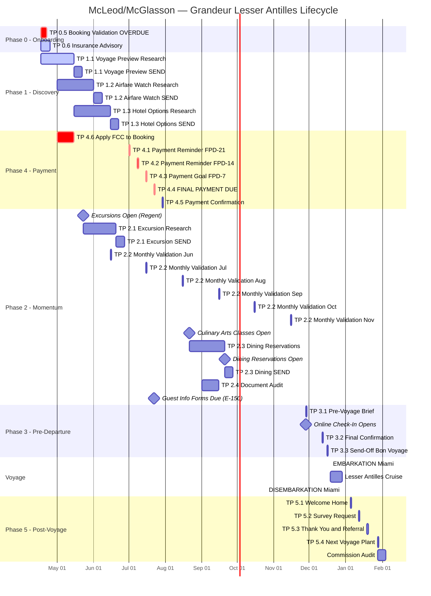

# CLIENT LIFECYCLE — Erik McLeod & Melissa McGlasson
## SS Grandeur | Lesser Antilles Journey | Dec 19-29, 2026
### Dreams2Memories Travel, LLC | Thunderbird Wing | Created 2026-04-17

---

| Field | Value |
|-------|-------|
| **Clients** | Erik Wiedenbach McLeod & Melissa Etola McGlasson |
| **Emails** | emcleod@gmail.com, memcglas@gmail.com |
| **Home** | 1414 Armstrong, Longmont, CO |
| **Ship** | Seven Seas Grandeur (Regent Seven Seas Cruises) |
| **Voyage** | Lesser Antilles Journey — Miami to Miami |
| **Embarkation** | Dec 19, 2026 |
| **Disembarkation** | Dec 29, 2026 |
| **Duration** | 10 nights |
| **Suite** | 863, Deck 8 — Concierge Suite E (447 sq ft) |
| **Booking** | 2984034 |
| **Total Booking** | $13,398.00 |
| **Paid to Date** | $1,004.85 (deposit received Feb 6, 2025) |
| **Balance Due** | $12,393.15 |
| **Final Payment Date** | Jul 22, 2026 |
| **Outstanding FCC** | $200 Regent FCC ($100/pp) — Gale Hotel Miami complaint Dec 2025. Apply to this booking. |
| **Guest Registration** | Erik McLeod COMPLETE, Melissa McGlasson COMPLETE |
| **Client Tier** | HIGH-VALUE REPEAT (4 active bookings) |
| **Email Standard** | GOLD STANDARD (Commander standing order) |
| **Competitive Risk** | ELEVATED — Pavlus Travel has visibility (see COMPETITIVE INTEL below) |

---

### PORTS OF CALL

| Order | Date (Est.) | Port | Island/Country |
|-------|-------------|------|----------------|
| 1 | Dec 19 | Miami, FL | USA — EMBARKATION |
| 2 | TBD | Charlotte Amalie | St. Thomas, USVI |
| 3 | TBD | Roseau | Dominica |
| 4 | TBD | St. John's | Antigua & Barbuda |
| 5 | TBD | Basseterre | St. Kitts & Nevis |
| 6 | TBD | Tortola | British Virgin Islands |
| — | TBD | At Sea (multiple days including Christmas) | — |
| 11 | Dec 29 | Miami, FL | USA — DISEMBARKATION |

> **Note:** Port dates are estimated. Exact day-by-day schedule to be verified against the Regent sailing itinerary. Port order confirmed via RSSC portal (scraped Mar 12, 2026).

---

> **COMPETITIVE INTEL — PAVLUS TRAVEL**
>
> **Threat Level: ELEVATED**
>
> Pavlus Travel has active visibility into McLeod/McGlasson bookings. The $200 Regent FCC was processed through a Pavlus complaint submission (Gale Hotel Miami, Dec 2025). Erik stated "I thanked Pavlus but didn't say more about working with them" — indicating active or prior Pavlus relationship.
>
> **Standing Order:** Every D2M touchpoint must reinforce value. No gaps in service, no missed dates, no dropped follow-ups. This client measures us against a known competitor. A single service failure is a defection opportunity.
>
> **Mitigation:**
> - Proactive communication on every milestone before client has to ask
> - Gold-standard email quality on every send (Commander SO)
> - Payment reminders early enough that Pavlus never gets the call first
> - Excursion/dining/airfare research delivered unprompted — demonstrate the value gap
> - Tie Dec 2027 Prestige booking into post-voyage touchpoints (retention anchor)

---

### FPD DISCREPANCY — RESOLVED

| Source | FPD Listed | Status |
|--------|------------|--------|
| RSSC Portal (scraped Mar 12, 2026) | **Jul 22, 2026** | CONFIRMED |
| Old dossier reference | Sep 1, 2026 | SUPERSEDED |

**Resolution:** Jul 22, 2026 is the confirmed FPD per the RSSC agent portal scrape dated Mar 12, 2026. The Sep 1 date from an earlier dossier version is stale. All lifecycle dates below use Jul 22 as the authoritative FPD.

---

### OTHER ACTIVE McLEOD/McGLASSON BOOKINGS (Context)

| Booking | Ship | Dates | FPD | Status |
|---------|------|-------|-----|--------|
| 298475-25 | Silver Muse | Jun 23 – Jul 3, 2026 | PAID ($27,813.32) | Active — pre-cruise Rome/Venice planning |
| **2984034** | **SS Grandeur** | **Dec 19-29, 2026** | **Jul 22 ($12,393.15)** | **THIS LIFECYCLE** |
| 3114500 | SS Prestige | Dec 18-28, 2027 | Jul 21, 2027 ($14,598.00) | Future — retention anchor |
| 8X6PGQ | Princess TBD | Mar 13-20, 2027 | ~Dec 2026 | Future |

---

## GANTT CHART — FULL LIFECYCLE



---

## STAFF WORKFLOW

```mermaid
flowchart TD
    CMD[Commander Loucks] --> HALE[COS Hale - Orchestration]

    HALE --> A2[A2 Dembe - Research]
    HALE --> A9[A9 Harlan - Finance]
    HALE --> A5[A5 Viper - Strategy]
    HALE --> A6[A6 Luna - Creative]
    HALE --> NAIA[EXEC Naia - Voice Review]
    HALE --> A7[A7 Gauge - Survey]

    A2 -->|Destinations, Fares, Hotels, Excursions| DANI[A3 Dani - Client Email]
    A9 -->|Payment Status, FCC, Commission| HALE
    A5 -->|Competitive Positioning vs Pavlus| HALE
    A6 -->|Destination Copy, Imagery| DANI
    A7 -->|Post-Voyage Survey| DANI

    DANI -->|Gold Standard Draft| NAIA
    NAIA -->|Voice-Polished Draft| HALE
    HALE -->|WF-17 QC Gate| CMD
    CMD -->|Approve/Edit| SEND[Send via d2mconcierge]

    subgraph QUALITY GATE
        direction LR
        Q1[Logo renders] --> Q2[Sig block correct]
        Q2 --> Q3[Cream/Blue stationery]
        Q3 --> Q4[Sign-off: Thanks]
        Q4 --> Q5[No AI disclaimer]
        Q5 --> Q6[Gold standard voice]
    end

    HALE -.->|Every email passes| QUALITY GATE
```

---

## MASTER TOUCHPOINT TABLE

| # | Phase | Touchpoint | Send Date | Research Start | Research End | Owner | Status | Notes |
|---|-------|------------|-----------|----------------|--------------|-------|--------|-------|
| **0.5** | 0 - Onboarding | Booking Confirmation / Validation | 2025-02-08 | — | — | Dani / Naia | 🔴 OVERDUE | Deposit received Feb 6, 2025. Validation never sent. PRIORITY. |
| **0.6** | 0 - Onboarding | Insurance Status Advisory | 2026-04-25 | 2026-04-17 | 2026-04-22 | A9 Harlan | 🔵 ACTIVE | Pre-existing window closed Jan 16, 2026. Standard coverage options still available. E-180 deadline Jun 22. |
| **1.1** | 1 - Discovery | Lesser Antilles Voyage Preview | 2026-05-15 | 2026-04-17 | 2026-05-08 | A2 Dembe / A6 Luna | 🔵 ACTIVE | Destination guide for all 5 ports. Imagery + dining + culture. |
| **1.2** | 1 - Discovery | Airfare Watch — DEN to/from MIA | 2026-06-01 | 2026-05-01 | 2026-05-25 | A2 Dembe | ⏳ PENDING | Denver (DEN) to Miami (MIA) round-trip. Business class options. |
| **1.3** | 1 - Discovery | Hotel Options — Pre/Post Miami | 2026-06-15 | 2026-05-15 | 2026-06-08 | A2 Dembe | ⏳ PENDING | Pre-cruise Dec 18 and/or post-cruise Dec 29 Miami hotels if needed. |
| **2.1** | 2 - Momentum | Excursion Research — All Ports | 2026-06-20 | 2026-05-23 | 2026-06-15 | A2 Dembe | ⏳ PENDING | Excursions open May 23 (Regent portal). Charlotte Amalie, Roseau, St. John's, Basseterre, Tortola. |
| **2.2a** | 2 - Momentum | Monthly Validation — June | 2026-06-15 | — | — | Dani / Naia | ⏳ PENDING | Status update, upcoming milestones. |
| **2.2b** | 2 - Momentum | Monthly Validation — July | 2026-07-15 | — | — | Dani / Naia | ⏳ PENDING | Post-FPD confirmation, excursion status. |
| **2.2c** | 2 - Momentum | Monthly Validation — August | 2026-08-15 | — | — | Dani / Naia | ⏳ PENDING | Culinary arts classes, document check. |
| **2.2d** | 2 - Momentum | Monthly Validation — September | 2026-09-15 | — | — | Dani / Naia | ⏳ PENDING | Dining reservations status, 90-day mark. |
| **2.2e** | 2 - Momentum | Monthly Validation — October | 2026-10-15 | — | — | Dani / Naia | ⏳ PENDING | 65-day mark. Final prep kickoff. |
| **2.2f** | 2 - Momentum | Monthly Validation — November | 2026-11-15 | — | — | Dani / Naia | ⏳ PENDING | 34-day mark. Online check-in reminder. |
| **2.3** | 2 - Momentum | Dining Reservations | 2026-09-20 | 2026-08-21 | 2026-09-15 | A2 Dembe | ⏳ PENDING | Culinary Arts Kitchen classes open Aug 21. Dining reservations open Sep 20. Seafood priority (clients are from Colorado). |
| **2.4** | 2 - Momentum | Document Audit — Passports & Guest Info | 2026-09-01 | 2026-08-15 | 2026-08-28 | Hale | ⏳ PENDING | Guest info forms due Jul 22 (E-150). Passport validity check. |
| **3.1** | 3 - Pre-Departure | Pre-Voyage Brief | 2026-11-28 | 2026-11-08 | 2026-11-22 | A2 Dembe / A6 Luna | ⏳ PENDING | E-21. Full voyage brief: ports, weather, dress, excursion confirmations, dining, emergency contacts. Online check-in opens same day. |
| **3.2** | 3 - Pre-Departure | Final Confirmation | 2026-12-12 | 2026-12-05 | 2026-12-10 | Hale / Dani | ⏳ PENDING | E-7. All confirmations compiled. Ground transport. Emergency contacts. |
| **3.3** | 3 - Pre-Departure | Bon Voyage Send-Off | 2026-12-16 | — | — | Dani / Naia | ⏳ PENDING | E-3. Warm send-off. Weather update. Last-minute tips. |
| **4.1** | 4 - Payment | Payment Reminder #1 (FPD-21) | 2026-07-01 | — | — | A9 Harlan / Dani | ⏳ PENDING | $12,393.15 balance. Gentle reminder. FCC application status. |
| **4.2** | 4 - Payment | Payment Reminder #2 (FPD-14) | 2026-07-08 | — | — | A9 Harlan / Dani | ⏳ PENDING | Second reminder. Payment options. |
| **4.3** | 4 - Payment | Payment Goal (FPD-7) | 2026-07-15 | — | — | A9 Harlan / Dani | ⏳ PENDING | Target early payment. Final call before due date. |
| **4.4** | 4 - Payment | FINAL PAYMENT DUE | 2026-07-22 | — | — | A9 Harlan / Hale | ⚠️ FPD CRITICAL | $12,393.15. Confirm received. Escalate to Commander if not paid by 5pm ET. |
| **4.5** | 4 - Payment | Payment Confirmation (FPD+7) | 2026-07-29 | — | — | A9 Harlan / Dani | ⏳ PENDING | Confirm payment posted. Updated balance. Next milestones preview. |
| **4.6** | 4 - Payment | Apply $200 Regent FCC to Booking | 2026-05-01 | 2026-04-17 | 2026-04-30 | A9 Harlan | 🔵 ACTIVE | $100/pp FCC from Gale Hotel Miami complaint Dec 2025. Verify in TESS/Regent system. Apply to booking 2984034. |
| **5.1** | 5 - Post-Voyage | Welcome Home | 2027-01-05 | — | — | Dani / Naia | ⏳ PENDING | D+7. Warm welcome back. Ask about highlights. |
| **5.2** | 5 - Post-Voyage | Survey / Review Request | 2027-01-12 | — | — | A7 Gauge / Dani | ⏳ PENDING | D+14. Structured feedback. TripAdvisor/Google review ask. |
| **5.3** | 5 - Post-Voyage | Thank You + Referral | 2027-01-19 | — | — | Dani / Naia | ⏳ PENDING | D+21. Gratitude + gentle referral ask. |
| **5.4** | 5 - Post-Voyage | Next Voyage Plant + Commission Audit | 2027-01-28 | — | — | A5 Viper / A9 Harlan | ⏳ PENDING | D+30. Tie into Dec 2027 Prestige booking (3114500). Commission audit on Grandeur booking. |

---

## KEY DATES — CHRONOLOGICAL

| Date | Event | Lifecycle Ref | Status |
|------|-------|---------------|--------|
| 2025-02-06 | Deposit received | — | ✅ COMPLETE |
| 2025-02-08 | Booking confirmation target (TP 0.5) | TP 0.5 | 🔴 OVERDUE |
| 2026-01-16 | Insurance pre-existing window closed | TP 0.6 | ✅ PAST — window closed |
| **2026-04-17** | **TODAY — Lifecycle created** | — | — |
| 2026-04-25 | Insurance advisory send | TP 0.6 | 🔵 ACTIVE |
| 2026-05-01 | FCC application start | TP 4.6 | 🔵 ACTIVE |
| 2026-05-15 | Voyage Preview send | TP 1.1 | 🔵 ACTIVE (research underway) |
| 2026-05-23 | Shore excursions open (Regent, 8pm ET) | TP 2.1 | ⏳ PENDING |
| 2026-06-01 | Airfare Watch send | TP 1.2 | ⏳ PENDING |
| 2026-06-15 | Hotel Options send / Monthly Validation Jun | TP 1.3 / 2.2a | ⏳ PENDING |
| 2026-06-20 | Excursion Research send | TP 2.1 | ⏳ PENDING |
| 2026-06-22 | E-180 Insurance decision deadline | TP 0.6 | ⏳ PENDING |
| 2026-07-01 | Payment Reminder #1 (FPD-21) | TP 4.1 | ⏳ PENDING |
| 2026-07-08 | Payment Reminder #2 (FPD-14) | TP 4.2 | ⏳ PENDING |
| 2026-07-15 | Payment Goal (FPD-7) / Monthly Validation Jul | TP 4.3 / 2.2b | ⏳ PENDING |
| **2026-07-22** | **FINAL PAYMENT DUE — $12,393.15** | **TP 4.4** | **⚠️ FPD CRITICAL** |
| 2026-07-22 | E-150 Guest Info Forms due | TP 2.4 | ⏳ PENDING |
| 2026-07-29 | Payment Confirmation (FPD+7) | TP 4.5 | ⏳ PENDING |
| 2026-08-15 | Monthly Validation Aug | TP 2.2c | ⏳ PENDING |
| 2026-08-21 | Culinary Arts Kitchen Classes open (Regent, 8pm ET) | TP 2.3 | ⏳ PENDING |
| 2026-08-21 | E-120 Pre-trip call window opens | — | ⏳ PENDING |
| 2026-09-01 | Document Audit start | TP 2.4 | ⏳ PENDING |
| 2026-09-15 | Monthly Validation Sep | TP 2.2d | ⏳ PENDING |
| 2026-09-20 | E-90 All docs confirmed / Dining reservations open (Regent, 8pm ET) | TP 2.3 | ⏳ PENDING |
| 2026-10-15 | Monthly Validation Oct | TP 2.2e | ⏳ PENDING |
| 2026-11-15 | Monthly Validation Nov | TP 2.2f | ⏳ PENDING |
| 2026-11-28 | E-21 Pre-Voyage Brief / Online Check-In Opens | TP 3.1 | ⏳ PENDING |
| 2026-12-05 | E-14 Regent milestone | — | ⏳ PENDING |
| 2026-12-12 | E-7 Final Confirmation | TP 3.2 | ⏳ PENDING |
| 2026-12-16 | E-3 Send-Off | TP 3.3 | ⏳ PENDING |
| **2026-12-19** | **EMBARKATION — Miami** | — | ⏳ PENDING |
| **2026-12-29** | **DISEMBARKATION — Miami** | — | ⏳ PENDING |
| 2027-01-05 | D+7 Welcome Home | TP 5.1 | ⏳ PENDING |
| 2027-01-12 | D+14 Survey / Review Request | TP 5.2 | ⏳ PENDING |
| 2027-01-19 | D+21 Thank You + Referral | TP 5.3 | ⏳ PENDING |
| 2027-01-28 | D+30 Next Voyage Plant + Commission Audit | TP 5.4 | ⏳ PENDING |

---

## STAFF LOAD SUMMARY

| Staff | Role | Touchpoints Assigned | Peak Load Period |
|-------|------|---------------------|------------------|
| **Hale (COS)** | Orchestration, QC, WF-17 gate, document audit | ALL (review) + TP 2.4, 3.2, 4.4 (primary) | Jun-Jul 2026 (FPD crunch + Silver Muse overlap) |
| **A2 Dembe** | Destination research, fares, hotels, excursions, Lesser Antilles intel | TP 1.1, 1.2, 1.3, 2.1, 2.3, 3.1 | Apr-Jun 2026 (Discovery phase) |
| **A3 Dani** | Client email formatting — GOLD STANDARD | TP 0.5, 2.2a-f, 3.3, 4.1-4.3, 4.5, 5.1, 5.2, 5.3 | Monthly (validation cadence) |
| **A5 Viper** | Competitive positioning vs Pavlus, booking strategy | TP 5.4 (primary), advisory on all sends | Ongoing (competitive monitoring) |
| **A6 Luna** | Destination copy, imagery, emotional travel writing | TP 1.1, 3.1 | Apr-May 2026 (Voyage Preview) |
| **A7 Gauge** | Survey design, post-voyage feedback | TP 5.2 | Jan 2027 |
| **A9 Harlan** | Payment tracking, FCC application, commission audit | TP 0.6, 4.1-4.6, 5.4 | May-Jul 2026 (FCC + FPD) |
| **EXEC Naia** | Voice review — EVERY email gets extra polish for this client | ALL client-facing sends | Continuous |

**Overlap Alert:** Silver Muse (Jun 23 - Jul 3, 2026) overlaps with the Grandeur FPD payment window (Jul 1-22). A2 Dembe and A9 Harlan will be loaded on both bookings simultaneously. Hale to manage sequencing — Silver Muse active voyage takes priority Jun 23-Jul 3, then immediate pivot to Grandeur FPD push.

---

## WEEKLY REPORT CADENCE

**Schedule:** Monday AM — emailed to johnloucks3@gmail.com (full send, not draft)

**Report Format:**
```
SUBJECT: [D2M COS] McLeod/McGlasson — Grandeur Lesser Antilles Weekly Status

CONTENTS:
1. Status dashboard (all TPs with current status indicators)
2. This week's actions completed
3. Next week's actions planned
4. Open items requiring Commander decision
5. Competitive intel updates (Pavlus monitoring)
6. Cross-booking coordination notes (Silver Muse / Prestige / Princess)
```

**Cadence by Phase:**

| Period | Frequency | Focus |
|--------|-----------|-------|
| Apr-May 2026 | Weekly | Discovery research, FCC application, insurance advisory |
| Jun 2026 | Weekly | Excursion research, Silver Muse active overlap management |
| Jul 2026 | **Daily during FPD week (Jul 15-22)** | Payment tracking — escalate daily until confirmed |
| Aug-Oct 2026 | Bi-weekly | Momentum phase, dining, document audit |
| Nov 2026 | Weekly | Pre-departure acceleration |
| Dec 1-19, 2026 | **Daily** | Final prep and send-off |
| Dec 19-29, 2026 | Monitoring only | Voyage active — watch for client comms |
| Jan 2027 | Weekly | Post-voyage touchpoints |

---

## SEARCH WINDOWS — RESEARCH LEAD TIMES

Each touchpoint gets a 90-120 day research lead. Research START is 120 days before send; research END is 90 days before send (or send date minus 7 days, whichever is later for near-term items).

| Touchpoint | Send Date | Research Start | Research End | Window (days) | Assigned To |
|------------|-----------|----------------|--------------|---------------|-------------|
| TP 0.5 Booking Validation | OVERDUE | IMMEDIATE | 2026-04-24 | 7 (recovery) | Dani / Naia |
| TP 0.6 Insurance Advisory | 2026-04-25 | 2026-04-17 | 2026-04-22 | 5 | A9 Harlan |
| TP 4.6 Apply FCC | 2026-05-01 | 2026-04-17 | 2026-04-28 | 11 | A9 Harlan |
| TP 1.1 Voyage Preview | 2026-05-15 | 2026-04-17 | 2026-05-08 | 21 | A2 Dembe / A6 Luna |
| TP 1.2 Airfare Watch | 2026-06-01 | 2026-05-01 | 2026-05-25 | 24 | A2 Dembe |
| TP 1.3 Hotel Options | 2026-06-15 | 2026-05-15 | 2026-06-08 | 24 | A2 Dembe |
| TP 2.1 Excursion Research | 2026-06-20 | 2026-05-23 | 2026-06-13 | 21 | A2 Dembe |
| TP 2.3 Dining Reservations | 2026-09-20 | 2026-08-21 | 2026-09-13 | 23 | A2 Dembe |
| TP 2.4 Document Audit | 2026-09-01 | 2026-08-15 | 2026-08-28 | 13 | Hale |
| TP 3.1 Pre-Voyage Brief | 2026-11-28 | 2026-11-08 | 2026-11-22 | 14 | A2 Dembe / A6 Luna |
| TP 3.2 Final Confirmation | 2026-12-12 | 2026-12-05 | 2026-12-10 | 5 | Hale / Dani |
| TP 3.3 Bon Voyage | 2026-12-16 | — | — | — | Dani / Naia |

---

## IMMEDIATE ACTIONS (As of 2026-04-17)

| Priority | Action | Owner | Deadline | Notes |
|----------|--------|-------|----------|-------|
| **P0** | TP 0.5 — Draft booking validation email (OVERDUE since Feb 2025) | Dani / Naia / Hale QC | 2026-04-22 | McLeod = gold standard. Extra polish. Include booking summary, suite details, FPD date, next steps. |
| **P1** | TP 4.6 — Verify $200 FCC in TESS/Regent system | A9 Harlan | 2026-04-30 | Source: Gale Hotel complaint processed via Pavlus. Confirm $100/pp credit exists and apply to booking 2984034. |
| **P1** | TP 0.6 — Insurance advisory (standard coverage options) | A9 Harlan | 2026-04-25 | Pre-existing window closed Jan 16. Present standard CFAR and medical coverage options. E-180 deadline Jun 22. |
| **P2** | TP 1.1 — Begin Lesser Antilles destination research | A2 Dembe | 2026-05-08 | All 5 ports: Charlotte Amalie, Roseau, St. John's, Basseterre, Tortola. Seafood dining priority. Independent traveler lens. |
| **P2** | Competitive monitoring — Pavlus Travel | A5 Viper | Ongoing | Assess any recent Pavlus activity. Ensure D2M is first to every milestone. |
| **P3** | CC Melissa on all future correspondence | ALL | Standing | memcglas@gmail.com on every send. Commander directive from Mar 17 email. |

---

## STATUS LEGEND

| Indicator | Meaning |
|-----------|---------|
| ✅ SENT | Touchpoint delivered and confirmed |
| 🔵 ACTIVE | Currently in research or production |
| ⏳ PENDING | Scheduled, not yet started |
| 🔴 OVERDUE | Past due date — requires immediate action |
| ⚠️ FPD CRITICAL | Final payment related — zero tolerance for missed dates |

---

## DOCUMENT HISTORY

| Date | Author | Action |
|------|--------|--------|
| 2026-04-17 | COS Hale (Claude) | Lifecycle created. 27 touchpoints across 5 phases. FPD confirmed Jul 22, 2026. |

---

*Col Victoria "Iron Vic" Hale — COS, Thunderbird Wing*
*Dreams2Memories Travel, LLC*
