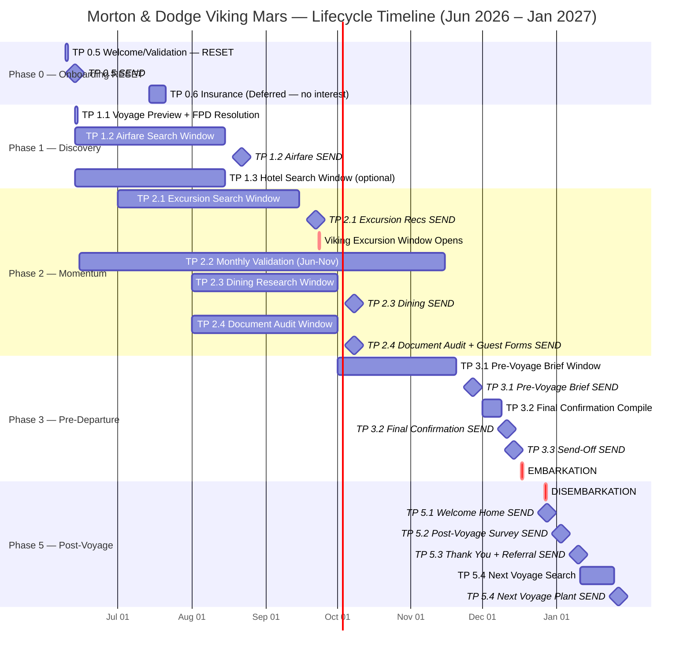
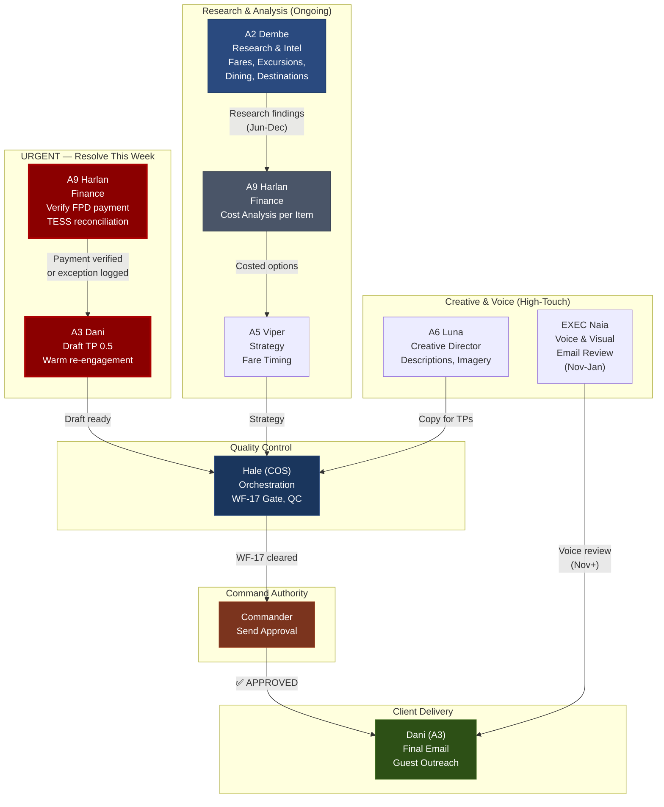

# MORTON & DODGE — CLIENT LIFECYCLE MANAGEMENT
## Viking Mars | Panama Canal & Central America | Dec 17-27, 2026

---

<div align="center">

**DREAMS2MEMORIES TRAVEL, LLC**
*Client Lifecycle Reset — Jun 9, 2026*

| | |
|---|---|
| **Document** | D2M-LC-MORTON-DODGE-2026 |
| **Version** | 1.0 |
| **Created** | 2026-06-09 |
| **Owner** | Col Victoria Hale, COS |
| **Classification** | INTERNAL — Wing Operations |
| **Status** | ⚠️ LIFECYCLE RESET — FPD Overdue, Zero TPs Sent |

</div>

---

## VOYAGE SHIELD

```
    ╔══════════════════════════════════════════════════════════╗
    ║                    VIKING MARS                          ║
    ║            PANAMA CANAL & CENTRAL AMERICA               ║
    ║                                                          ║
    ║   Panama City ──► Canal Transit ──► Cartagena            ║
    ║   Santa Marta ──► Puerto Limon ──► Fort Lauderdale       ║
    ║                                                          ║
    ║         2 GUESTS  ·  1 SUITE  ·  10 NIGHTS              ║
    ║            Dec 17, 2026 — Dec 27, 2026                   ║
    ║                                                          ║
    ║               TOTAL PAID: $6,148  ✅                      ║
    ║          STATUS: FPD MARKED OVERDUE (70+ days)           ║
    ║     ENGAGEMENT: Zero TPs sent — relationship cold        ║
    ╚══════════════════════════════════════════════════════════╝
```

---

## TABLE OF CONTENTS

1. [Booking Summary](#1-booking-summary)
2. [Guest Directory](#2-guest-directory)
3. [Itinerary & Ports](#3-itinerary--ports)
4. [Current State Audit](#4-current-state-audit)
5. [Lifecycle Timeline (Gantt)](#5-lifecycle-timeline-gantt)
6. [Touchpoint Master Table](#6-touchpoint-master-table)
7. [Immediate Actions Required](#7-immediate-actions-required)
8. [Staff Workflow Pipeline](#8-staff-workflow-pipeline)
9. [Key Dates Sidebar](#9-key-dates-sidebar)
10. [Routing & Delivery Rules](#10-routing--delivery-rules)

---

## 1. BOOKING SUMMARY

| Field | Details |
|-------|---------|
| **Agency Conf** | CUW88R8 |
| **Guests** | Joshua Morton & Erica Dodge |
| **Booking Date** | Feb 8, 2026 |
| **Stateroom** | 3015 (V1 — Veranda, Deck 3) |
| **Fare Code** | OMAPSF26-3 ($3,099 pp) |
| **Total Paid** | $6,148 |
| **Viking SBC** | $200 ($100/guest) |
| **Payment Status** | ✅ PAID IN FULL (Mar 27, 2026) per dossier; ⚠️ FPD flagged OVERDUE in financial tracking |
| **Ancillary Status** | Flights, transfers NOT YET BOOKED |
| **Insurance** | Declined (pre-existing window closed Feb 23) |

**Grand Total Paid:** $6,148
**Payment Method:** Kyle Kuklinski CC on file (CVC 7435 — received Mar 25; Kyle paying all three Viking Mars bookings: himself, Roger, and Morton/Dodge)

---

## 2. GUEST DIRECTORY

| # | Guest | DOB | Email | Phone | Home Base | Air Route |
|---|-------|-----|-------|-------|-----------|-----------|
| 1 | **Joshua Morton** | 1945-12-11 | josh@jerichopix.com | 818-317-9843 | Naples, FL | RSW → FLL |
| 2 | **Erica Dodge** | 1948-03-04 | buzzerica@gmail.com | 603-812-5173 | Naples, FL | RSW → FLL |

**Guest Form Status:**
- Joshua Morton: ⚠️ **MISSING** — follow up required
- Erica Dodge: ⚠️ **MISSING** — follow up required

**Relationship Context:**
- Part of Kuklinski Viking Panama group (3 couples, booked together)
- Josh & Erica's cabin (3015) is separate from Kuklinski cabins (4122, 8012)
- No direct relationship history with D2M prior to this booking
- Zero communication since booking confirmation Feb 8

---

## 3. ITINERARY & PORTS

| Day | Date | Port | Country | Notes |
|-----|------|------|---------|-------|
| 1 | Dec 17 (Thu) | **Panama City** | Panama | Embarkation 3:00 PM |
| 2 | Dec 18 (Fri) | **Panama Canal Transit** | Panama | Full canal daylight transit |
| 3 | Dec 19 (Sat) | **Cartagena** | Colombia | UNESCO Old Town, fortress |
| 4 | Dec 20 (Sun) | **Santa Marta** | Colombia | Tayrona gateway, historic center |
| 5 | Dec 21 (Mon) | **Puerto Limon** | Costa Rica | Rainforest, wildlife, Tortuguero |
| 6 | Dec 22 (Tue) | *Sea Day* | -- | At sea |
| 7 | Dec 23 (Wed) | *Sea Day* | -- | At sea |
| 8 | Dec 24 (Thu) | *Sea Day* | -- | Christmas Eve at sea |
| 9 | Dec 25 (Fri) | *Sea Day* | -- | Christmas Day at sea |
| 10 | Dec 26 (Sat) | *Sea Day* | -- | At sea |
| 11 | Dec 27 (Sun) | **Fort Lauderdale** | USA | Disembarkation 5:00 AM |

---

## 4. CURRENT STATE AUDIT

### Issue Summary (as of Jun 9, 2026)

| Category | Status | Severity | Notes |
|----------|--------|----------|-------|
| **FPD Payment** | ⚠️ CONFLICTED | MEDIUM | Dossier states PAID Mar 27, 2026. Financial snapshot (Apr 28) shows $6,148 OVERDUE. TESS status unclear. **ACTION: Harlan verification required.** |
| **Touchpoint History** | 🔴 ZERO | CRITICAL | No TPs sent to client since booking Feb 8. Lifecycle never initiated. |
| **Guest Forms** | 🔴 MISSING | HIGH | Both Joshua and Erica missing guest forms. Required for embarkation. |
| **Flights** | ⚠️ NOT BOOKED | HIGH | RSW ↔ FLL air quote not yet provided. No booking. |
| **Transfers** | ⚠️ NOT BOOKED | MEDIUM | Panama City airport to pier; FLL pier to airport — not arranged. |
| **Relationship Engagement** | 🔴 COLD | CRITICAL | Zero communication since Feb 8 booking confirmation. Client may be unaware of D2M involvement or expectations. |

### Root Cause Analysis

**Why is the lifecycle at zero?**
- Morton/Dodge were booked as part of the Kuklinski group (Kyle paying all three bookings)
- Primary engagement pattern defaulted to Kuklinski as the group contact and payor
- Morton/Dodge never received a formal welcome/validation from D2M as individual clients
- No handoff protocol for group bookings → separate couple treatment

**Why is FPD status conflicted?**
- Dossier manually set to `fpd_status: PENDING` and text says PAID, but Apr 28 financial snapshot showed OVERDUE
- Kyle Kuklinski may have paid his own bookings (9593880, 9593873) and NOT paid for Morton/Dodge (9595029)
- OR the payment was made but not recorded in financial tracking system
- **REQUIRES: Harlan independent verification against TESS / cruise line statement**

---

## 5. LIFECYCLE TIMELINE (GANTT)



---

## 6. TOUCHPOINT MASTER TABLE

### Phase 0 — Onboarding RESET

| # | TP | Name | Owner | Send Date | Status | Notes |
|---|-----|------|-------|-----------|--------|-------|
| 1 | **0.5** | Welcome / Validation + FPD Resolution | Dani | **Jun 13** | 🔴 DRAFT READY | First touch. Soft FPD reminder embedded in warm welcome. Acknowledgment that they're part of the Kuklinski group but deserve individual attention. |
| 2 | **0.6** | Insurance Discussion | Dani | Jul 28 | ⏸ DEFERRED | Client declined during booking (pre-existing window closed). Revisit mid-July. |

### Phase 1 — Discovery

| # | TP | Name | Search Window | Send Date | Status | Owner | Notes |
|---|-----|------|---------------|-----------|--------|-------|-------|
| 3 | **1.1** | Voyage Preview | -- | Jun 13 | 🔴 DRAFT READY | Dani | Panama Canal + ports overview. Combined with TP 0.5. |
| 4 | **1.2** | Airfare Watch | Jun 13 - Aug 15 | **Aug 22** | 🔵 ACTIVE SEARCH | A2 Dembe | **RSW → FLL** roundtrip (Southwest Florida to Fort Lauderdale). Group return Dec 27. |
| 5 | **1.3** | Hotel Options | Jun 13 - Aug 15 | **Aug 22** | ⏳ OPTIONAL | A2 Dembe | Panama City pre-cruise OR FLL post-cruise. Client may not need hotel (lives in FL, close to FLL). Soft offer. |

### Phase 2 — Momentum

| # | TP | Name | Search Window | Send Date | Status | Owner | Notes |
|---|-----|------|---------------|-----------|--------|-------|-------|
| 6 | **2.1** | Excursion Recs | Jul 1 - Sep 15 | **Sep 22** | ⏳ PENDING | A2 Dembe | Recs ready before Viking window opens Sep 23. 5 excursion options per port. |
| 7 | **2.2** | Monthly Validation | -- | **15th of each month** | 🔵 ACTIVE SEARCH | Dani | Monthly booking validation template. 6 sends total (Jun-Nov). Watch for guest form completion. |
| 8 | **2.3** | Dining Research | Aug 1 - Oct 1 | **Oct 8** | ⏳ PENDING | A2 Dembe | Onboard specialty dining + port restaurant recs. |
| 9 | **2.4** | Document Audit + Guest Forms | Aug 1 - Oct 1 | **Oct 8** | ⏳ PENDING | A2 Dembe | **CRITICAL:** Passports (valid 6mo beyond Dec 27), visas (if needed), health docs, **guest forms** (MISSING — first request in TP 2.4). |

### Phase 3 — Pre-Departure

| # | TP | Name | Owner | Send Date | Status | Notes |
|---|-----|------|-------|-----------|--------|-------|
| AR | **AR-3.0** | **Embarkation Gift — ORDER** | Commander | **Nov 17** (E-30) | ⏳ PENDING | Order/arrange in-suite amenity or gift by E-30 (if applicable). |
| 10 | **3.1** | Pre-Voyage Brief | A2 Dembe / Luna | **Nov 27** | ⏳ PENDING | Destination deep-dive, packing, logistics. |
| 11 | **3.2** | Final Confirmation | Hale | **Dec 11** | ⏳ PENDING | All bookings, flights, hotels, transfers consolidated. Confirm with Kyle/Kuklinski if any group logistics. |
| 12 | **3.3** | Send-Off | Dani | **Dec 14** | ⏳ PENDING | Bon voyage — 3 days before embarkation |

### Phase 5 — Post-Voyage

| # | TP | Name | Owner | Send Date | Status | Notes |
|---|-----|------|-------|-----------|--------|-------|
| 13 | **5.1** | Welcome Home | Dani | **Dec 28** | ⏳ PENDING | Day after disembarkation |
| 14 | **5.2** | Post-Voyage Survey | A7 Gauge | **Jan 3, 2027** | ⏳ PENDING | NPS + experience survey |
| 15 | **5.3** | Thank You + Referral | Dani / Naia | **Jan 10, 2027** | ⏳ PENDING | Handwritten-style thank you + referral ask |
| 16 | **5.4** | Next Voyage Plant | A5 Viper | **Jan 27, 2027** | ⏳ PENDING | Seed next trip based on preferences learned |

---

## 7. IMMEDIATE ACTIONS REQUIRED

### 72-Hour Window (Jun 9-12, 2026)

| Priority | Action | Owner | Deadline | Notes |
|----------|--------|-------|----------|-------|
| 🔴 P0 | **Verify FPD payment status** | Harlan (A9) | Jun 10 | TESS check. Independent financial sign-off. Was Kyle's Mar 27 payment for 3 bookings or only 2? Resolve before client touch. |
| 🔴 P0 | **Draft TP 0.5 re-engagement email** | Dani (A3) | Jun 12 | Warm welcome + soft FPD acknowledgment + next steps. Creative chain if needed. WF-17 gate Jun 13. |
| 🟡 P1 | **Initiate airfare search** | A2 Dembe | Jun 15 | RSW-FLL roundtrip Dec 17-27. Planning ranges to Commander by Jun 20. |
| 🟡 P1 | **Confirm guest forms** | Dani | Jun 15 | Request both Joshua and Erica complete guest forms (embedded in TP 0.5 or separate quick email). |

### Relationship Reset Messaging

**Key theme for TP 0.5:** "We've been quietly preparing your voyage alongside the Kuklinski group. Now it's time to focus on making YOUR experience unforgettable. Here's what we've lined up…"

Tone: Warm, acknowledgment of the group booking dynamic, but personalized to Josh & Erica. No apology (nothing went wrong), just forward momentum.

---

## 8. STAFF WORKFLOW PIPELINE



---

## 9. KEY DATES SIDEBAR

### Critical External Dates

| Date | Event | Action Required |
|------|-------|-----------------|
| **Sep 23, 2026** | Viking excursion booking window opens | Excursion recs (TP 2.1) must be delivered by Sep 22 |
| **Dec 17, 2026** | Embarkation — Panama City, 3:00 PM | All pre-departure TPs complete by Dec 14 |
| **Dec 27, 2026** | Disembarkation — Fort Lauderdale, 5:00 AM | Post-voyage sequence begins Dec 28 |

### Internal Milestone Dates (RESET CADENCE)

| Date | Milestone | Status |
|------|-----------|--------|
| **Jun 9** | Lifecycle reset decision — zero TPs sent to date | 🔴 RESET INITIATED |
| **Jun 10** | Harlan FPD verification | ⏳ BLOCKING |
| **Jun 13** | TP 0.5 sent (warm welcome + voyage overview + FPD soft touch) | ⏳ READY TO SEND |
| **Jun 15-20** | Airfare search begins; planning ranges to Commander | ⏳ |
| **Aug 15** | Airfare + hotel search window closes | ⏳ |
| **Aug 22** | TP 1.2 Airfare + TP 1.3 Hotel (optional) send | ⏳ |
| **Sep 15** | Excursion search window closes | ⏳ |
| **Sep 23** | **Viking excursion booking window opens** | ⏳ |
| **Sep 22** | TP 2.1 Excursion Recs send (deadline: day before window) | ⏳ |
| **Oct 1** | Dining + document audit windows close | ⏳ |
| **Oct 8** | TP 2.3 Dining + TP 2.4 Document Audit + **Guest Forms** send | ⏳ |
| **Nov 20** | Pre-voyage brief window closes | ⏳ |
| **Nov 27** | TP 3.1 Pre-Voyage Brief send | ⏳ |
| **Dec 1-9** | TP 3.2 Final Confirmation compile | ⏳ |
| **Dec 11** | TP 3.2 Final Confirmation send | ⏳ |
| **Dec 14** | TP 3.3 Send-Off | ⏳ |
| **Dec 17** | **EMBARKATION** | ⏳ |
| **Dec 27** | **DISEMBARKATION** | ⏳ |
| **Dec 28** | TP 5.1 Welcome Home | ⏳ |
| **Jan 3, 2027** | TP 5.2 Post-Voyage Survey | ⏳ |
| **Jan 10, 2027** | TP 5.3 Thank You + Referral | ⏳ |
| **Jan 27, 2027** | TP 5.4 Next Voyage Plant send | ⏳ |

---

## 10. ROUTING & DELIVERY RULES

### Email Routing

| Product Type | Created In | Sent To | Delivery Method |
|-------------|------------|---------|-----------------|
| **Touchpoint emails** (TP 0.5 – 5.4) | d2mconcierge@gmail.com | Joshua (josh@jerichopix.com) + Erica (buzzerica@gmail.com) | **DRAFT** for Commander approval (WF-17 gate) |
| **Monthly validation emails** | d2mconcierge@gmail.com | johnloucks3@gmail.com (copy at 0600) then clients | **DRAFT** + full send to Commander |
| **Weekly research reports** | d2mconcierge@gmail.com | johnloucks3@gmail.com | **FULL SEND** (SO 27 MAR 2026) |

### Send Gate Protocol

1. **Dani** formats the client email
2. **Hale** runs WF-17 quality gate (logo, sig block, stationery, tone)
3. **Draft** placed in d2mconcierge Gmail + copy to johnloucks3 at 0600
4. **Commander** reviews and approves/edits
5. **Send** executed only after explicit Commander "yes"

### Stationery Standard

| Element | Value |
|---------|-------|
| Paper | Cream #f7f3ea |
| Ink | Bright Blue #0000ff |
| Font | Georgia, serif |
| Logo | D2M navy banner |
| Sign-off | "Thanks" or "Thank you" |
| From | concierge@d2mluxury.quest (send-as alias on d2mconcierge) |
| Phone | 719-291-0742 |

---

## CROSS-REFERENCES

| Document | Location | Purpose |
|----------|----------|---------|
| Client Dossier | `~/Thunderbird/dossiers/Morton_Joshua_Erica_Viking_Panama.md` | Guest details, booking confirmations, email log |
| Group Master Dossier | `~/Thunderbird/dossiers/DOSSIER_VikingMars_PanamaCanal_Dec2026.md` | All three bookings (Kuklinski, Kuklinski, Morton/Dodge) |
| Kuklinski Lifecycle | `~/Thunderbird/D2M/lifecycle/Kuklinski_Viking_Panama_Lifecycle.md` | Reference lifecycle (same ship, same voyage) |
| TESS Booking | Booking #9595029 | Cruise line booking system |
| Mission Board | MISSION-142, MISSION-156, MISSION-165 | Lifecycle reset work |
| Viking Mars Ship Intel | `~/Thunderbird/core/intel/` | Ship intelligence data |

---

*Document: D2M-LC-MORTON-DODGE-2026 | Dreams2Memories Travel, LLC | Thunderbird Wing Operations*
*Owner: Col Victoria Hale, COS | Classification: INTERNAL*
*Created: 2026-06-09 | Status: LIFECYCLE RESET IN PROGRESS*
