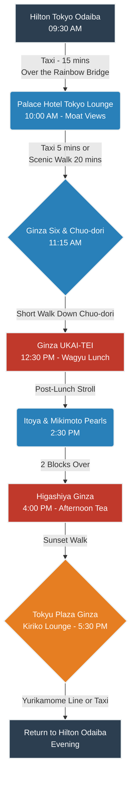

# GINZA ROMANCE SPATIAL FLOW

```mermaid
flowchart TD
    classDef hotel fill:#2c3e50,stroke:#ecf0f1,stroke-width:2px,color:#fff;
    classDef food fill:#c0392b,stroke:#ecf0f1,stroke-width:2px,color:#fff;
    classDef sight fill:#2980b9,stroke:#ecf0f1,stroke-width:2px,color:#fff;
    classDef sunset fill:#e67e22,stroke:#ecf0f1,stroke-width:2px,color:#fff;

    A[Hilton Tokyo Odaiba<br>09:30 AM]:::hotel -->|Taxi - 15 mins<br>Over the Rainbow Bridge| B(Palace Hotel Tokyo Lounge<br>10:00 AM - Moat Views):::sight
    B -->|Taxi 5 mins or<br>Scenic Walk 20 mins| C{Ginza Six & Chuo-dori<br>11:15 AM}:::sight
    C -->|Short Walk Down Chuo-dori| D[Ginza UKAI-TEI<br>12:30 PM - Wagyu Lunch]:::food
    D -->|Post-Lunch Stroll| E(Itoya & Mikimoto Pearls<br>2:30 PM):::sight
    E -->|2 Blocks Over| F[Higashiya Ginza<br>4:00 PM - Afternoon Tea]:::food
    F -->|Sunset Walk| G{Tokyu Plaza Ginza<br>Kiriko Lounge - 5:30 PM}:::sunset
    G -->|Yurikamome Line or Taxi| H[Return to Hilton Odaiba<br>Evening]:::hotel
```
