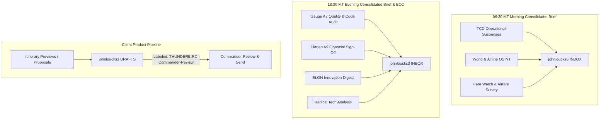

# ⚡ STAFF SUMMARY SHEET (SSS-2026-0728-01)
**TO:** Commander John A. Loucks III, Owner & COO, Dreams2Memories Travel, LLC  
**FROM:** Ms. Victoria "Victory" Hale, SES-6 — Chief of Staff, Thunderbird Wing  
**DATE:** July 28, 2026  
**SUBJECT:** Comprehensive Thunderbird Wing Reporting Overhaul, Draft Restaging & Standing Order SO-REPORTING-2026  

---

## 1. PURPOSE
To present the results of the Wing Staff Exercise on Reporting Governance, execute a full inventory of all inbox and draft pipelines, restage 36 trapped drafts from `d2mconcierge` to `johnloucks3`, consolidate scattered report daemons into two batched daily delivery windows (06:30 MT & 18:30 MT), and enact **Standing Order SO-REPORTING-2026**.

---

## 2. BACKGROUND & DIAGNOSIS
A comprehensive audit of the Wing reporting architecture revealed severe operational friction:
* **Draft Trapping (36 Items):** Internal briefs, decision dashboards, and client product drafts were being created inside `d2mconcierge@gmail.com` drafts—a mailbox the Commander never opens.
* **Fragmented & Repetitive Daemons:** Independent daemons (0600 Brief, 1800 Brief, EOD Quality Audit, ELON Innovation, Radical Tech Scan, Daily Intel) fired at random intervals throughout the day, repeatedly sending duplicate and stale data.
* **Misrouted Delivery Channels:** Internal reports were being saved as Gmail drafts instead of being delivered directly to the Commander's `johnloucks3@gmail.com` INBOX.

---

## 3. WING STAFF EXERCISE FINDINGS & ROSTER INPUTS

### 🦅 HALE (Chief of Staff / Executive Officer)
* **Action:** Restage all 36 `d2mconcierge` drafts into `johnloucks3@gmail.com` Drafts (labeled `THUNDERBIRD-Commander-Review`). Re-route all internal briefs directly to `johnloucks3@gmail.com` INBOX.

### 🎨 DANI (A3 Creative & Client Products Lead)
* **Action:** Standardize all internal briefs and client product previews on the **Dark Navy (`#07076b`) HTML Template Standard**. Enforce premailer CSS inlining and canonical signature blocks.

### 🛡️ STERLING (A7 Operations & Command Chief)
* **Action:** Decommission ungoverned background daemons creating unreviewed drafts. Implement pre-commit enforcement of SO-REPORTING-2026 to prevent config-drift re-allows.

### 🛰️ INTEL (A2 Intelligence & OSINT Lead)
* **Action:** Consolidate World Intel, Airline Monitor, Fare Watch, and OSINT sweeps into the **06:30 MT Morning Consolidated Brief**. Eliminate standalone hourly intel alerts.

### 💰 HARLAN (A9 Financial Verification Lead)
* **Action:** Embed the independent 6-step financial sign-off block into the **18:30 MT Evening Consolidated Brief & EOD**. Track commission aging and host tier status daily.

---

## 4. PROPOSED REPORTING ARCHITECTURE (2 BATCHED WINDOWS)



---

## 5. RECOMMENDATION & ACTION
Recommend Commander approve SSS-2026-0728-01 and sign **Standing Order SO-REPORTING-2026** to enact the universal reporting standard.

```text
[  ] APPROVED
[  ] DISAPPROVED
[  ] APPROVED WITH MODIFICATIONS: _____________________________________

Signature: __________________________________   Date: _______________
           John A. Loucks III, Owner
```
